# 04. 에이전트 역할 상세 분석

## 🎯 에이전트 전체 맵

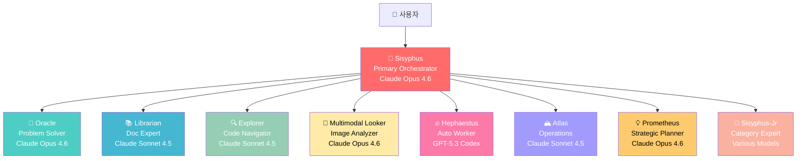

## 1️⃣ Sisyphus - 최고 지휘자

### 📋 기본 정보

```yaml
이름: Sisyphus (시지프스)
역할: Primary Orchestrator
모델: Claude Opus 4.6 / Kimi K2.5 / GLM-5
계층: Layer 1 (조율자)
권한: 모든 도구 사용 가능
```

### 🎭 역할 상세

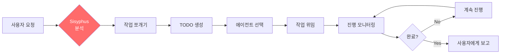

### 💪 핵심 능력

**1. 작업 분해 (Task Decomposition)**

```
입력: "쇼핑몰 웹사이트 만들어줘"

Sisyphus의 사고 과정:
┌─────────────────────────────────────┐
│ 1. 요구사항 분석                     │
│    - 쇼핑몰 = 상품 목록 + 장바구니   │
│    - 웹사이트 = 프론트 + 백엔드     │
│                                     │
│ 2. 작업 쪼개기                      │
│    ✓ 데이터베이스 스키마 설계        │
│    ✓ 백엔드 API 개발                │
│    ✓ 프론트엔드 UI 개발             │
│    ✓ 인증 시스템                    │
│    ✓ 테스트 코드                    │
│    ✓ 배포 설정                      │
│                                     │
│ 3. 우선순위 결정                    │
│    1순위: DB + API (기반)           │
│    2순위: UI + 인증 (핵심)          │
│    3순위: 테스트 + 배포 (마무리)    │
└─────────────────────────────────────┘
```

**2. 에이전트 선택 전략**

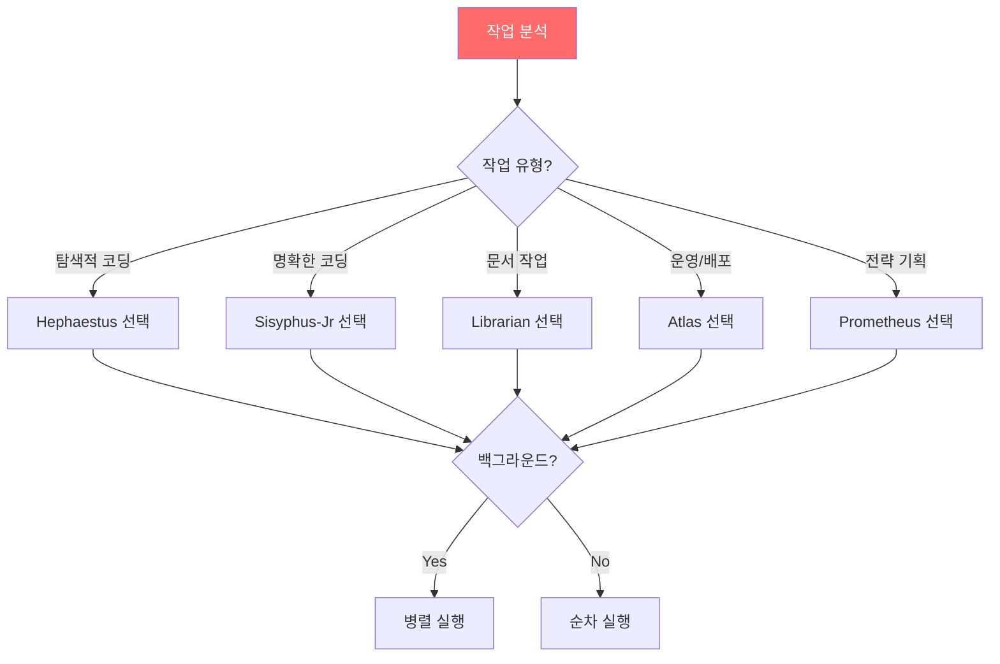

**3. TODO 관리 시스템**

```typescript
// Sisyphus의 TODO 관리 예시
interface Todo {
  content: string;         // "백엔드 API 개발"
  status: 'pending' | 'in_progress' | 'completed';
  agent?: string;          // "Hephaestus"
  dependencies?: string[]; // 이 작업 전에 완료해야 할 것들
}

const todos: Todo[] = [
  {
    content: "DB 스키마 설계",
    status: "completed",
    agent: "Sisyphus-Jr"
  },
  {
    content: "백엔드 API 개발",
    status: "in_progress",
    agent: "Hephaestus",
    dependencies: ["DB 스키마 설계"]
  },
  {
    content: "프론트엔드 UI",
    status: "pending",
    dependencies: ["백엔드 API 개발"]
  }
];
```

### 🎬 실제 대화 예시

```
[사용자]
"React 프로젝트를 TypeScript로 변환해줘"

[Sisyphus]
작업을 분석했습니다. TODO 리스트를 생성합니다:
□ 프로젝트 구조 파악
□ TypeScript 설정 파일 생성
□ .js 파일을 .tsx/.ts로 변환
□ 타입 정의 추가
□ 컴파일 에러 수정
□ 테스트 실행 및 검증

Explorer를 호출하여 프로젝트를 탐색하겠습니다...

[Explorer]
탐색 완료. 총 45개의 JavaScript 파일 발견.

[Sisyphus]
Hephaestus와 Sisyphus-Jr를 병렬로 실행합니다.
- Hephaestus: src/components 변환
- Sisyphus-Jr: src/utils 변환

진행 상황:
✓ 프로젝트 구조 파악
✓ TypeScript 설정 파일 생성
⏳ .js 파일 변환 중... (60%)

(계속 진행...)
```

## 2️⃣ Oracle - 문제 해결 컨설턴트

### 📋 기본 정보

```yaml
이름: Oracle (오라클)
역할: Problem Solver / Consultant
모델: Claude Opus 4.6
계층: Layer 2 (전문가)
권한: 읽기 전용 (파일 수정 불가)
```

### 🎭 언제 호출되나?

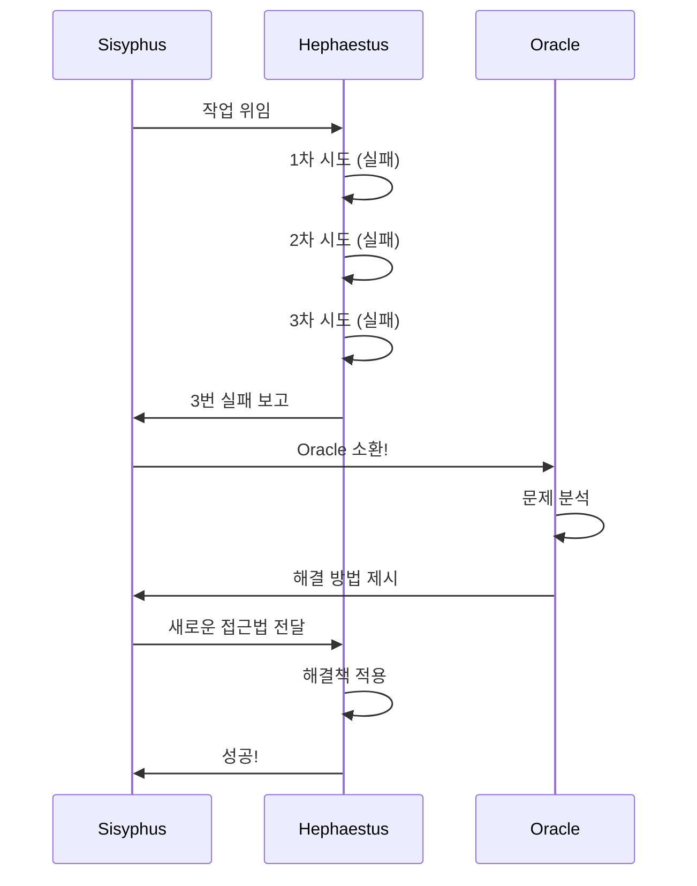

### 💡 Oracle의 특징

**1. 읽기 전용 (Read-Only)**

```
❌ Oracle이 못하는 것:
- 파일 수정
- 코드 실행
- 명령 실행

✅ Oracle이 하는 것:
- 코드 분석
- 문제 진단
- 해결책 제안
- 아키텍처 조언
```

**2. 깊은 사고 능력**

```
일반 에이전트:
"이 에러는 변수가 없어서 발생합니다."

Oracle:
"이 에러의 근본 원인은:
1. 의존성 순환 참조 문제
2. 모듈 로딩 순서 이슈
3. TypeScript 타입 추론 한계

해결 방법:
A. 의존성 구조 재설계 (권장)
B. Dynamic Import 사용
C. Type Assertion 사용 (임시방편)"
```

### 🎬 실제 상황 예시

```
[Hephaestus]
에러: Cannot read property 'map' of undefined
1차 시도: null 체크 추가 → 실패
2차 시도: optional chaining 사용 → 실패
3차 시도: default 값 설정 → 여전히 undefined

[Sisyphus]
Oracle을 호출합니다...

[Oracle]
분석 결과:
- 문제: 비동기 데이터 로딩 타이밍 이슈
- 원인: useEffect의 의존성 배열 오류
- 근본: React 생명주기 이해 부족

권장 해결책:
1. useEffect 의존성 배열 수정
2. 로딩 상태 추가 (isLoading)
3. 데이터 로드 전까지 fallback UI 표시

코드 예시:
[Oracle가 제공하는 올바른 패턴]

[Hephaestus]
Oracle의 조언대로 수정합니다...
성공!
```

## 3️⃣ Librarian - 문서 탐색 전문가

### 📋 기본 정보

```yaml
이름: Librarian (사서)
역할: Documentation Expert
모델: Claude Sonnet 4.5
계층: Layer 2 (전문가)
특기: 빠른 정보 검색 및 요약
```

### 🔍 주요 기능

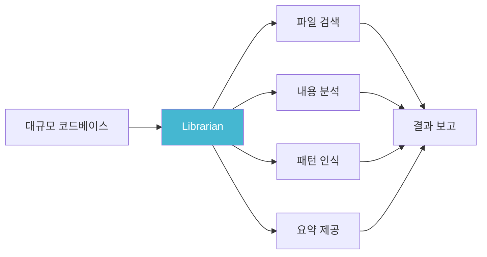

### 💼 사용 사례

**케이스 1: 프로젝트 구조 파악**

```
[Sisyphus]
"Librarian, 이 프로젝트 구조 파악해줘"

[Librarian]
분석 완료:

프로젝트 구조:
📁 src/
  ├─ 📁 components/ (45 files)
  │   ├─ 📁 common/ (재사용 컴포넌트)
  │   └─ 📁 features/ (기능별 컴포넌트)
  ├─ 📁 services/ (8 files)
  │   └─ API 통신 로직
  ├─ 📁 utils/ (12 files)
  │   └─ 헬퍼 함수들
  └─ 📁 types/ (6 files)
      └─ TypeScript 타입 정의

사용 기술:
- React 18.2
- TypeScript 5.0
- Vite 빌드
- Redux Toolkit 상태관리
- React Router v6
```

**케이스 2: 특정 기능 찾기**

```
[Sisyphus]
"인증 로직이 어디 있는지 찾아줘"

[Librarian]
검색 결과:

인증 관련 파일:
1. src/services/auth.service.ts
   - login(), logout(), refreshToken()

2. src/contexts/AuthContext.tsx
   - 전역 인증 상태 관리

3. src/hooks/useAuth.ts
   - 커스텀 훅

4. src/middleware/authMiddleware.ts
   - 인증 미들웨어

사용 패턴:
- JWT 토큰 기반
- LocalStorage에 저장
- Axios interceptor로 자동 갱신
```

## 4️⃣ Explorer - 코드베이스 탐험가

### 📋 기본 정보

```yaml
이름: Explorer (탐험가)
역할: Codebase Navigator
모델: Claude Sonnet 4.5 / Haiku
계층: Layer 2 (전문가)
특기: 빠른 파일 시스템 탐색
```

### 🗺️ Librarian과의 차이

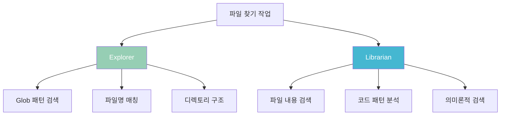

**간단히 말하면:**
- **Explorer**: "어디에 있는지" 찾기
- **Librarian**: "무엇이 있는지" 찾기

## 5️⃣ Hephaestus - 자율 코딩 전문가

### 📋 기본 정보

```yaml
이름: Hephaestus (헤파이스토스)
역할: Autonomous Deep Worker
모델: GPT-5.3 Codex
계층: Layer 3 (실행자)
특기: 탐색하면서 코딩
```

### 🔥 핵심 특징

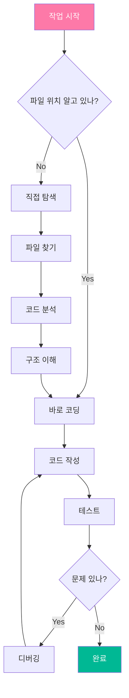

### 🆚 Sisyphus-Jr와의 차이

```
Sisyphus-Jr (지시형 에이전트):
입력: "src/utils/format.ts의 formatDate 함수를 수정해줘"
동작: 정확히 그 파일만 수정
특징: 빠르고 정확, 하지만 창의성 낮음

Hephaestus (자율형 에이전트):
입력: "날짜 포맷 관련 버그 고쳐줘"
동작:
  1. 날짜 포맷 관련 파일 탐색
  2. 여러 파일에서 문제 발견
  3. 연관된 파일까지 모두 수정
  4. 테스트 케이스 추가
특징: 느리지만 자율적, 근본적 해결
```

### 🎬 실제 사용 예시

```
[Sisyphus]
"Hephaestus야, 쇼핑몰 장바구니 기능을 구현해줘"

[Hephaestus]
알겠습니다. 탐색을 시작합니다...

1. 프로젝트 구조 파악
   - Redux 상태관리 사용 중
   - API는 /api/cart 엔드포인트 사용

2. 필요한 파일 생성
   ✓ src/features/cart/cartSlice.ts
   ✓ src/features/cart/CartView.tsx
   ✓ src/api/cartAPI.ts

3. 연관 파일 수정
   ✓ src/store/index.ts (reducer 추가)
   ✓ src/routes/index.tsx (라우트 추가)
   ✓ src/types/cart.ts (타입 정의)

4. 테스트 추가
   ✓ src/features/cart/__tests__/cartSlice.test.ts

5. 통합 테스트
   ✓ 장바구니 추가 OK
   ✓ 수량 변경 OK
   ✓ 삭제 OK

완료!
```

## 6️⃣ Atlas - 운영 및 배포 전문가

### 📋 기본 정보

```yaml
이름: Atlas (아틀라스)
역할: Operations Specialist
모델: Claude Sonnet 4.5
계층: Layer 3 (실행자)
특기: 인프라, 배포, CI/CD
```

### 🏔️ 담당 영역

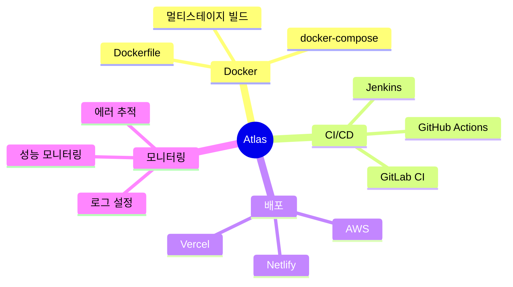

### 🎬 실제 사용 예시

```
[Sisyphus]
"Atlas야, 이 프로젝트를 Docker로 컨테이너화해줘"

[Atlas]
Docker 설정을 시작합니다.

1. 프로젝트 분석
   - Node.js 18 사용
   - React + Vite
   - 환경변수 필요

2. Dockerfile 생성
   ✓ 멀티스테이지 빌드 적용
   ✓ 최적화된 이미지 크기

3. docker-compose.yml 생성
   ✓ 개발 환경 설정
   ✓ DB 연결 설정

4. .dockerignore 생성
   ✓ 불필요한 파일 제외

5. CI/CD 파이프라인 추가
   ✓ GitHub Actions 워크플로우
   ✓ 자동 빌드 & 배포

테스트:
$ docker-compose up
→ 성공!

완료!
```

## 7️⃣ Prometheus - 전략 기획자

### 📋 기본 정보

```yaml
이름: Prometheus (프로메테우스)
역할: Strategic Planner
모델: Claude Opus 4.6
계층: Layer 3 (실행자)
특기: 사전 기획, 요구사항 명확화
```

### 💡 언제 사용하나?

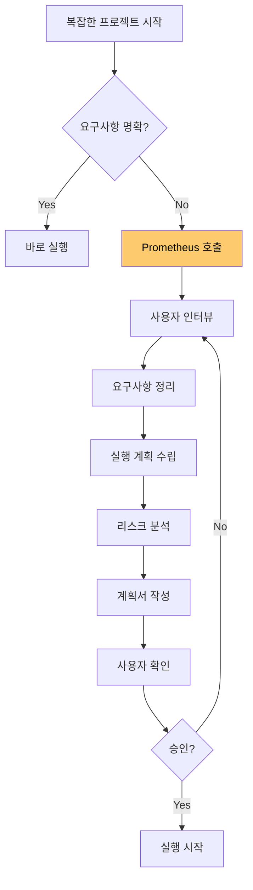

### 🎤 인터뷰 진행 방식

```
[Prometheus]
안녕하세요. 프로젝트 기획을 도와드리겠습니다.
몇 가지 질문드리겠습니다.

Q1. 이 프로젝트의 주요 목적은 무엇인가요?
→ [사용자 답변]

Q2. 주요 사용자는 누구인가요?
→ [사용자 답변]

Q3. 필수 기능과 선택 기능을 구분해주세요.
→ [사용자 답변]

Q4. 기술 스택에 제약이 있나요?
→ [사용자 답변]

Q5. 일정과 우선순위는?
→ [사용자 답변]

[Prometheus]
감사합니다. 실행 계획을 작성하겠습니다...

=== 프로젝트 실행 계획 ===

1. Phase 1: 기반 구축 (2시간)
   - DB 스키마 설계
   - API 기본 구조

2. Phase 2: 핵심 기능 (4시간)
   - 사용자 인증
   - 주요 CRUD 기능

3. Phase 3: 부가 기능 (2시간)
   - 알림 시스템
   - 검색 기능

리스크:
⚠️ 외부 API 의존성 (대응: 폴백 방안 준비)
⚠️ 복잡한 권한 관리 (대응: RBAC 패턴 적용)

진행할까요?
```

## 8️⃣ Sisyphus-Jr - 카테고리 전문가

### 📋 기본 정보

```yaml
이름: Sisyphus-Jr (시지프스 주니어)
역할: Category-Specialized Expert
모델: 다양 (카테고리에 따라 변경)
계층: Layer 3 (실행자)
특기: 도메인 특화 작업
```

### 🎨 카테고리 시스템

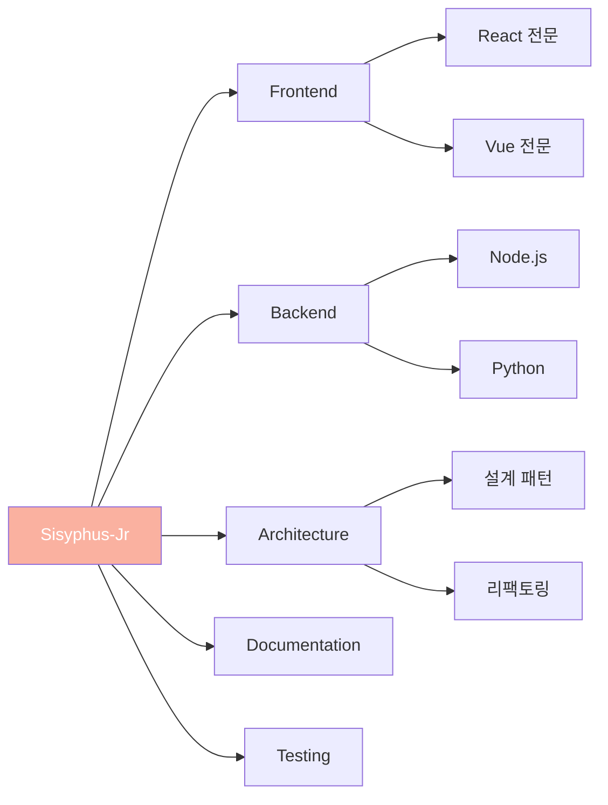

### 🔧 카테고리별 최적화

**Frontend 카테고리 예시:**

```typescript
{
  category: "frontend",
  model: "claude-sonnet-4-5",
  skills: [
    "React 컴포넌트 설계",
    "CSS-in-JS",
    "상태 관리 (Redux, Zustand)",
    "성능 최적화"
  ],
  context: `
    당신은 프론트엔드 전문가입니다.
    - 컴포넌트 재사용성 고려
    - 접근성 (a11y) 준수
    - 모바일 반응형 디자인
  `
}
```

**Backend 카테고리 예시:**

```typescript
{
  category: "backend",
  model: "gpt-5.3-codex",
  skills: [
    "RESTful API 설계",
    "데이터베이스 최적화",
    "보안 (인증/인가)",
    "성능 튜닝"
  ],
  context: `
    당신은 백엔드 전문가입니다.
    - API 보안 고려
    - 에러 처리 철저히
    - 데이터 검증 필수
  `
}
```

## 🎯 에이전트 선택 흐름도

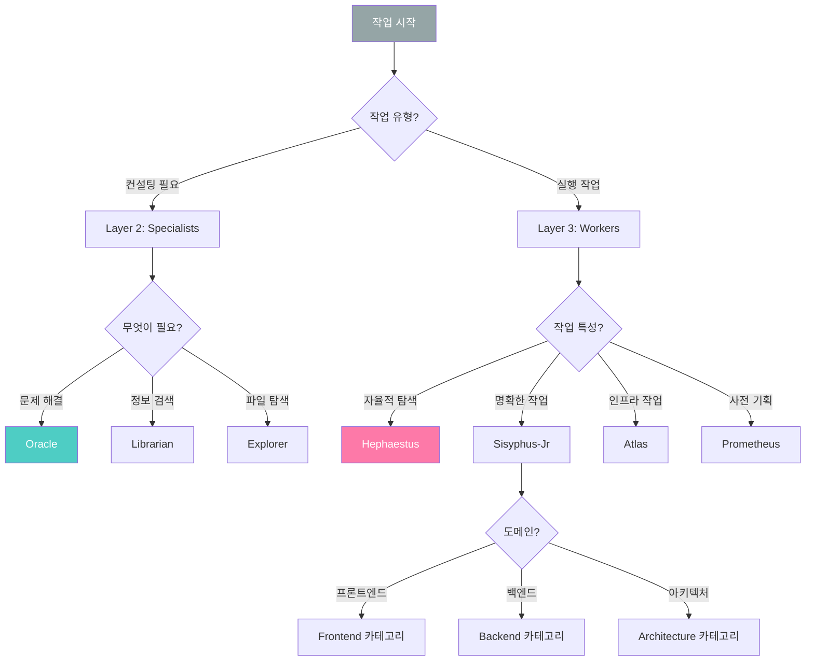

## 📊 에이전트 비교표

| 에이전트 | 계층 | 모델 | 읽기 | 쓰기 | 자율성 | 속도 | 비용 |
|---------|------|------|------|------|--------|------|------|
| Sisyphus | L1 | Opus 4.6 | ✅ | ✅ | ⭐⭐⭐⭐⭐ | 🐢 | 💰💰💰 |
| Oracle | L2 | Opus 4.6 | ✅ | ❌ | ⭐⭐⭐⭐ | 🐢 | 💰💰💰 |
| Librarian | L2 | Sonnet 4.5 | ✅ | ❌ | ⭐⭐ | 🐇 | 💰💰 |
| Explorer | L2 | Sonnet/Haiku | ✅ | ❌ | ⭐ | 🚀 | 💰 |
| Hephaestus | L3 | GPT-5.3 | ✅ | ✅ | ⭐⭐⭐⭐⭐ | 🐢 | 💰💰💰 |
| Atlas | L3 | Sonnet 4.5 | ✅ | ✅ | ⭐⭐⭐ | 🐇 | 💰💰 |
| Prometheus | L3 | Opus 4.6 | ✅ | ✅ | ⭐⭐⭐⭐ | 🐢 | 💰💰💰 |
| Sisyphus-Jr | L3 | 다양 | ✅ | ✅ | ⭐⭐⭐ | 🐇 | 💰💰 |

## 🎓 핵심 정리

### 에이전트 역할 요약

```
Layer 1 (조율자):
  🎩 Sisyphus → 전체 지휘

Layer 2 (전문가):
  🔮 Oracle → 문제 해결
  📚 Librarian → 문서 검색
  🔍 Explorer → 파일 탐색

Layer 3 (실행자):
  🔥 Hephaestus → 자율 코딩
  🏔️ Atlas → 운영/배포
  💡 Prometheus → 전략 기획
  👶 Sisyphus-Jr → 도메인 전문
```

### 선택 가이드

```
언제 어떤 에이전트를 쓸까?

막혔을 때:
→ Oracle

정보가 필요할 때:
→ Librarian / Explorer

복잡한 코딩:
→ Hephaestus

빠른 코딩:
→ Sisyphus-Jr

배포 작업:
→ Atlas

프로젝트 기획:
→ Prometheus
```

## 🎯 다음 단계

에이전트 역할을 이해했으니, 실제 동작 원리를 봅시다:

1. ✅ **01-프로젝트-소개.md** - 프로젝트 소개
2. ✅ **02-기본-개념.md** - 용어 설명
3. ✅ **03-전체-구조.md** - 시스템 구조
4. ✅ **04-에이전트-역할.md** ← 지금 여기
5. ➡️ **05-동작-원리.md** - 실제 작동 과정 (시퀀스 다이어그램)
6. **06-claude-code-적용.md** - Claude Code와 연결
7. **07-실전-예시.md** - 실제 사용 사례

---

**💡 핵심 요약**
- **8개의 전문 에이전트** 각자 명확한 역할
- **3계층 구조**: 조율자 → 전문가 → 실행자
- **작업별 최적 선택**: 상황에 맞는 에이전트
- **읽기 vs 쓰기**: Specialists는 조언만, Workers는 실행
- **모델 다양성**: 작업에 맞는 AI 모델 사용
