# 05. 동작 원리 - 실전 시나리오

## 🎯 전체 흐름 개요

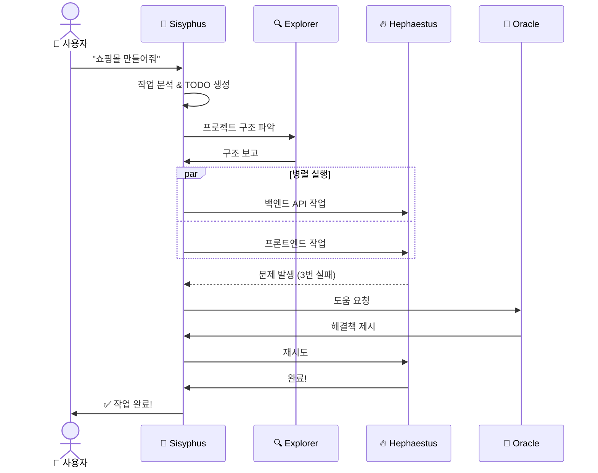

## 📝 시나리오 1: 간단한 기능 추가

### 상황
사용자: "로그인 페이지에 '비밀번호 찾기' 버튼 추가해줘"

### 전체 흐름

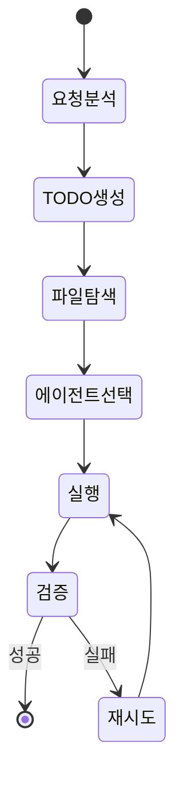

### 상세 과정

**1단계: Sisyphus가 작업 분석**

```
[Sisyphus의 사고 과정]
┌─────────────────────────────────────┐
│ 요청: "비밀번호 찾기 버튼 추가"      │
│                                     │
│ 분석:                               │
│ ✓ 단순 UI 추가 작업                 │
│ ✓ 복잡한 로직 불필요                │
│ ✓ 빠른 실행 가능                    │
│                                     │
│ 결정:                               │
│ → Sisyphus-Jr (Frontend) 사용      │
│ → 병렬 실행 불필요                  │
│ → Explorer로 파일 먼저 찾기         │
└─────────────────────────────────────┘
```

**2단계: Explorer가 파일 찾기**

```typescript
// Explorer 실행
$ glob "**/*login*.tsx"

결과:
- src/pages/LoginPage.tsx ← 이거!
- src/components/LoginForm.tsx
- src/hooks/useLogin.ts
```

**3단계: Sisyphus-Jr가 코드 수정**

```tsx
// Before (LoginPage.tsx)
<Button onClick={handleLogin}>
  로그인
</Button>

// After (Sisyphus-Jr가 추가)
<Button onClick={handleLogin}>
  로그인
</Button>
<Button variant="text" onClick={handleForgotPassword}>
  비밀번호 찾기
</Button>
```

**4단계: 검증 및 완료**

```
[Sisyphus]
✓ TODO: 로그인 페이지 파일 찾기
✓ TODO: 비밀번호 찾기 버튼 추가
✓ TODO: 핸들러 함수 추가
✓ TODO: 라우트 연결

모든 작업 완료!
```

### 시퀀스 다이어그램

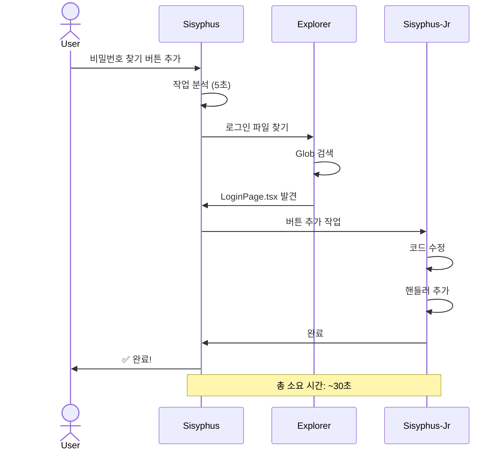

## 🏗️ 시나리오 2: 중간 복잡도 작업

### 상황
사용자: "React 프로젝트를 TypeScript로 변환해줘"

### 전체 흐름

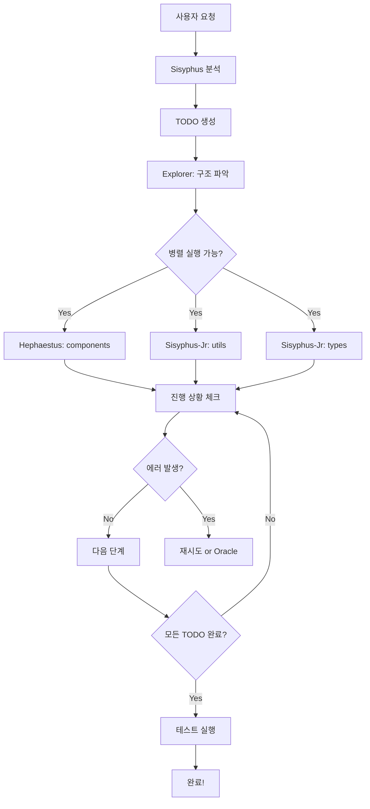

### 상세 과정

**1단계: 작업 분해**

```
[Sisyphus] 작업을 분석합니다...

TODO 리스트:
□ 프로젝트 구조 파악
□ TypeScript 설정 파일 생성
□ JSX → TSX 변환
□ 타입 정의 파일 생성
□ 컴파일 에러 수정
□ Import 경로 수정
□ 테스트 코드 변환
□ 빌드 테스트
```

**2단계: 탐색 단계**

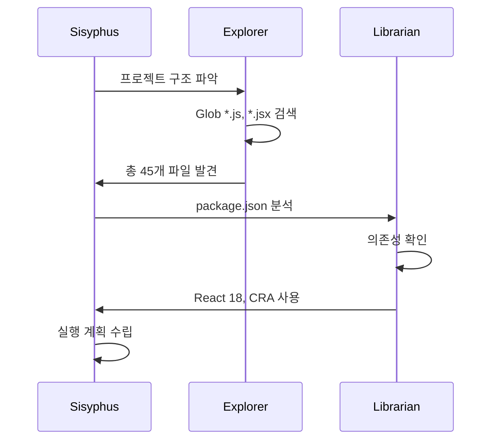

**3단계: 병렬 실행**

```
[Sisyphus] 작업을 3개 에이전트에게 분배합니다.

┌─────────────────┬─────────────────┬─────────────────┐
│  Hephaestus     │  Sisyphus-Jr 1  │  Sisyphus-Jr 2  │
├─────────────────┼─────────────────┼─────────────────┤
│ src/components/ │ src/utils/      │ src/pages/      │
│ (복잡한 컴포넌트)│ (간단한 유틸)    │ (페이지들)      │
│                 │                 │                 │
│ [Background]    │ [Background]    │ [Background]    │
│ 15 files        │ 10 files        │ 20 files        │
└─────────────────┴─────────────────┴─────────────────┘

동시 진행 중...
```

**4단계: 실시간 진행 상황**

```
[Sisyphus] TODO 업데이트:
✓ 프로젝트 구조 파악
✓ TypeScript 설정 파일 생성
⏳ JSX → TSX 변환 (45/45 files)
  ✓ Hephaestus: 15/15
  ✓ Sisyphus-Jr 1: 10/10
  ✓ Sisyphus-Jr 2: 20/20
⏳ 타입 정의 파일 생성
□ 컴파일 에러 수정
□ Import 경로 수정
□ 테스트 코드 변환
□ 빌드 테스트
```

**5단계: 에러 처리**

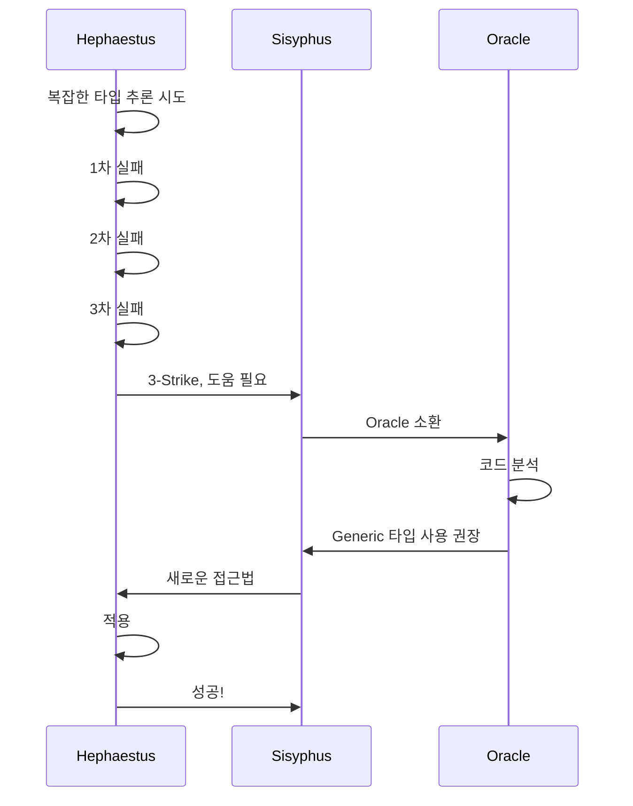

**6단계: 최종 검증**

```
[Sisyphus] 모든 변환 완료. 검증을 시작합니다.

$ tsc --noEmit
→ 에러 5개 발견

[Sisyphus] 에러 수정 중...
[Hephaestus] 타입 에러 수정 완료

$ tsc --noEmit
→ ✅ 에러 없음

$ npm run build
→ ✅ 빌드 성공

$ npm test
→ ✅ 모든 테스트 통과

[Sisyphus] 작업 완료!
```

### 전체 타임라인

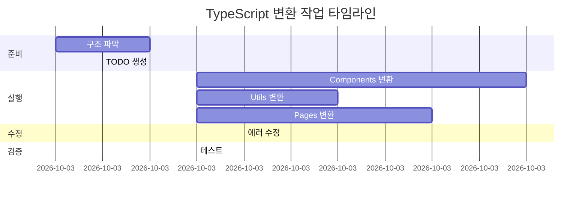

**총 소요 시간**: 약 10분 (순차 실행 시 20분+)

## 🚨 시나리오 3: 복잡한 작업 + 에러 상황

### 상황
사용자: "레거시 코드베이스를 최신 React 18로 마이그레이션하고 성능 최적화해줘"

### 복잡도 분석

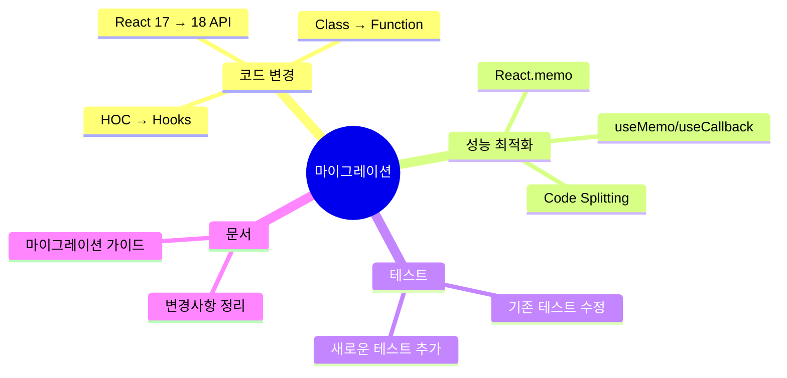

### 실행 흐름

**1단계: Prometheus 사전 기획**

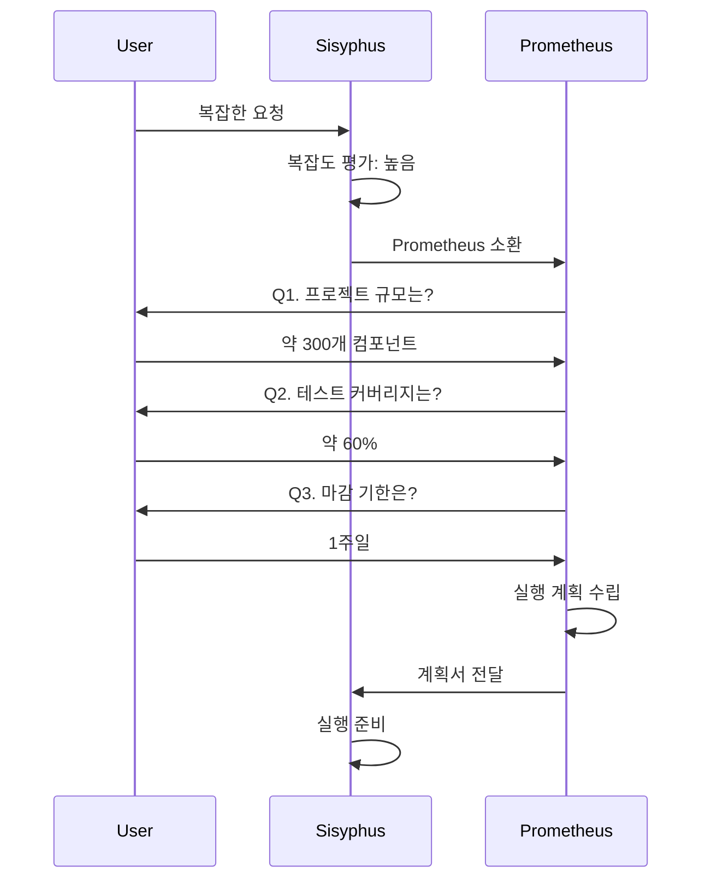

**2단계: 다단계 실행 계획**

```
[Prometheus] 실행 계획

=== Phase 1: 분석 (1시간) ===
□ 레거시 패턴 식별
□ Breaking Changes 리스트업
□ 리스크 평가

=== Phase 2: 마이그레이션 (3시간) ===
□ React 18 API 적용
□ Concurrent Features 도입
□ Suspense 통합

=== Phase 3: 최적화 (2시간) ===
□ 불필요한 리렌더링 제거
□ 코드 분할
□ Lazy Loading

=== Phase 4: 검증 (1시간) ===
□ 전체 테스트
□ 성능 측정
□ 문서 작성

총 예상 시간: 7시간
리스크: 중간 (기존 테스트 실패 가능성)
```

**3단계: 복잡한 병렬 실행**

```mermaid
gantt
    title 복잡한 마이그레이션 작업
    dateFormat HH:mm
    section Phase 1
    레거시 분석          :p1, 09:00, 1h
    section Phase 2
    API 업데이트         :p2a, 10:00, 2h
    Hooks 변환          :p2b, 10:00, 3h
    Concurrent 적용     :p2c, 12:00, 1h
    section Phase 3
    성능 측정           :p3a, 13:00, 1h
    최적화 적용         :p3b, 14:00, 2h
    section Phase 4
    테스트             :p4a, 16:00, 1h
    문서               :p4b, 16:00, 1h
```

**4단계: 에러 복구 시나리오**

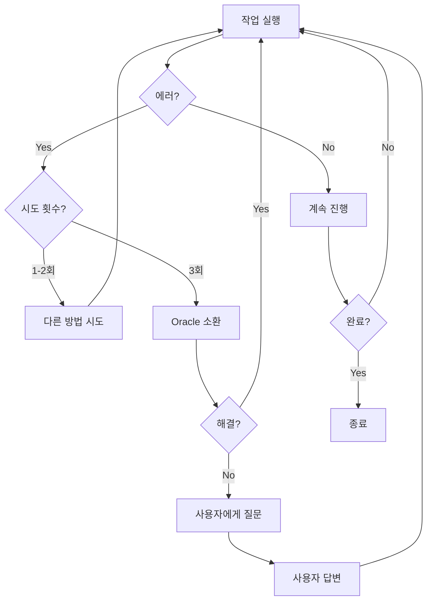

**실제 에러 상황 예시:**

```
[Hephaestus] Phase 2 진행 중...
에러: React 18의 새로운 타입 정의와 호환 불가

1차 시도: 타입 단언 사용
→ 실패: 런타임 에러 발생

2차 시도: 레거시 타입 유지
→ 실패: 컴파일 에러

3차 시도: 제네릭 타입 변경
→ 실패: 여전히 불일치

[Sisyphus] Oracle을 호출합니다.

[Oracle] 분석 결과:
문제: @types/react 버전 불일치
해결: package.json 업데이트 필요

{
  "@types/react": "^18.2.0" // 이전: ^17.0.0
}

[Hephaestus] 의존성 업데이트 후 재시도...
성공!
```

## 🔄 시나리오 4: 자동 완료 시스템 (Ralph Loop)

### Ralph Loop란?

**Ralph = Repeat And Loop Perpetually, Helping**
- 끝날 때까지 반복하는 자동화 시스템
- TODO가 남아있으면 절대 멈추지 않음

### 동작 원리

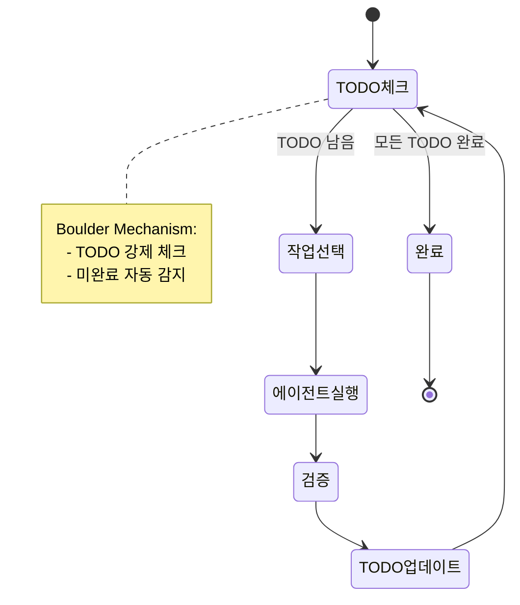

### 실제 사용 예시

```
[사용자]
$ ultrawork "쇼핑몰 완전히 만들어줘"

[Sisyphus]
TODO 생성:
□ DB 설계
□ 백엔드 API
□ 프론트엔드 UI
□ 인증 시스템
□ 결제 시스템
□ 관리자 페이지
□ 테스트 코드
□ 배포 설정
□ 문서 작성

자동 실행 시작... (Ralph Loop 활성화)

[1시간 후]
✓ DB 설계
✓ 백엔드 API
✓ 프론트엔드 UI
⏳ 인증 시스템 (진행 중)
□ 결제 시스템
□ 관리자 페이지
□ 테스트 코드
□ 배포 설정
□ 문서 작성

계속 진행 중... (사용자 개입 불필요)

[3시간 후]
✓ DB 설계
✓ 백엔드 API
✓ 프론트엔드 UI
✓ 인증 시스템
✓ 결제 시스템
✓ 관리자 페이지
⏳ 테스트 코드 (진행 중)
□ 배포 설정
□ 문서 작성

[5시간 후]
모든 TODO 완료!
✅ 작업 종료
```

### Boulder Mechanism (강제 완료 시스템)

```typescript
// Boulder Mechanism 의사 코드
function boulderMechanism() {
  while (true) {
    const todos = getTodos();
    const incompleteTodos = todos.filter(t => t.status !== 'completed');

    if (incompleteTodos.length === 0) {
      console.log("✅ 모든 작업 완료!");
      break; // 진짜 완료!
    }

    // 미완료 TODO가 있으면
    const nextTodo = incompleteTodos[0];
    console.log(`⏳ 다음 작업: ${nextTodo.content}`);

    executeAgent(nextTodo);

    // 끝나지 않고 다시 체크!
  }
}
```

**왜 Boulder(바위)인가?**
- 그리스 신화의 시지프스가 바위를 끝없이 밀어올림
- OmO의 Sisyphus는 TODO를 끝까지 밀어서 완료시킴

## 🛠️ 핵심 메커니즘들

### 1. 7-Section Delegation Protocol

에이전트에게 작업을 위임할 때 사용하는 구조화된 프롬프트:

```
┌───────────────────────────────────────────┐
│  1. 🎯 Mission (임무)                      │
│     "React 컴포넌트를 리팩토링해라"        │
├───────────────────────────────────────────┤
│  2. 📋 Context (맥락)                      │
│     "이 프로젝트는 e-commerce 앱이다"      │
│     "현재 성능 이슈가 있다"                │
├───────────────────────────────────────────┤
│  3. 🛠️ Tools (도구)                        │
│     "사용 가능: Read, Edit, Bash"          │
│     "LSP로 정확한 리팩토링 가능"           │
├───────────────────────────────────────────┤
│  4. 🎭 Identity (정체성)                   │
│     "너는 프론트엔드 전문가다"             │
│     "React 성능 최적화에 능숙하다"         │
├───────────────────────────────────────────┤
│  5. ⚠️ Constraints (제약사항)              │
│     "기존 API 인터페이스 유지"             │
│     "테스트 코드는 건드리지 마라"          │
├───────────────────────────────────────────┤
│  6. 📊 Success Criteria (성공 기준)        │
│     "리렌더링 50% 감소"                    │
│     "번들 크기 20% 감소"                   │
│     "모든 테스트 통과"                     │
├───────────────────────────────────────────┤
│  7. 🔄 Recovery (복구 방법)                │
│     "막히면 Oracle에게 물어봐라"           │
│     "3번 실패 시 사용자에게 질문"          │
└───────────────────────────────────────────┘
```

### 2. Session Resume (세션 재개)

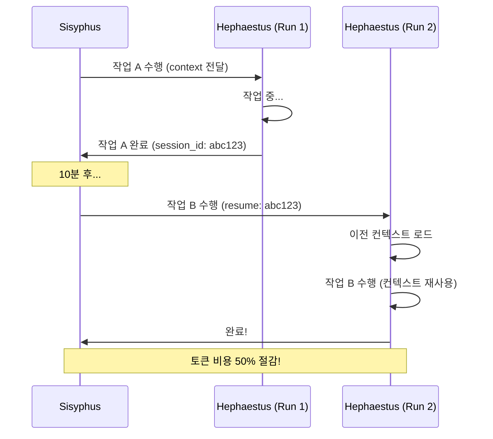

**장점:**
- 같은 컨텍스트 반복 전달 불필요
- 토큰 비용 절감
- 빠른 실행

### 3. Intent Gate (의도 분석)

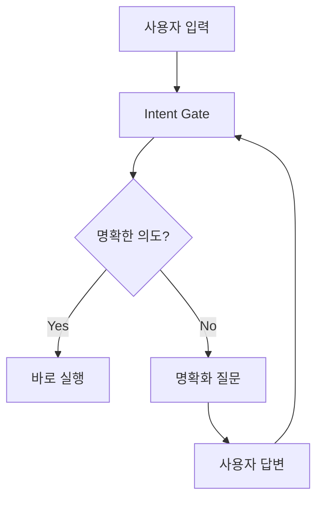

**예시:**

```
[사용자]
"성능 개선해줘"

[Intent Gate]
의도가 불명확합니다. 추가 정보 필요:

Q1. 어떤 성능 개선인가요?
    A. 로딩 속도
    B. 반응성
    C. 메모리 사용량

Q2. 어느 부분인가요?
    A. 전체
    B. 특정 페이지
    C. 특정 기능

[사용자]
"A와 B, 특정 페이지(상품 목록)"

[Intent Gate]
명확해졌습니다. 실행합니다:
"상품 목록 페이지의 로딩 속도와 반응성 개선"
```

## 🎯 최적화 전략

### 작업 타입별 에이전트 선택

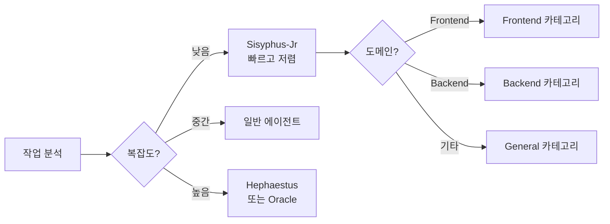

### 비용 최적화

```
단일 Claude Opus 사용 시:
- 모든 작업에 Opus 사용
- 간단한 탐색도 Opus
- 비용: 높음 💰💰💰

OmO 최적화 방식:
- 조율: Opus (필수)
- 코딩: Sonnet (충분)
- 탐색: Haiku (빠름)
- 비용: 30-50% 절감 💰
```

## 📊 성능 비교

### 작업별 소요 시간

| 작업 | 단일 에이전트 | OmO | 개선율 |
|------|--------------|-----|--------|
| 간단한 수정 | 1분 | 30초 | 50% ⬆️ |
| 중간 리팩토링 | 20분 | 10분 | 50% ⬆️ |
| 대규모 마이그레이션 | 5시간 | 3시간 | 40% ⬆️ |
| 프로젝트 생성 | 2시간 | 1시간 | 50% ⬆️ |

### 사용자 개입 빈도

```
일반 AI 도구:
▓░░░░ ▓░░░░ ▓░░░░ ▓░░░░ (매 5분마다 개입)

OmO:
▓░░░░░░░░░░░░░░░░░░░░░ (시작과 끝만 개입)
```

## 🎓 핵심 정리

### 동작 원리 요약

```
1. 사용자 요청
   ↓
2. Sisyphus 분석 & TODO 생성
   ↓
3. 에이전트 선택 & 병렬 실행
   ↓
4. 실시간 진행 추적
   ↓
5. 에러 시 자동 복구
   ↓
6. 완료까지 자동 반복
   ↓
7. 검증 & 보고
```

### 핵심 메커니즘

- **7-Section Delegation**: 구조화된 작업 위임
- **Ralph Loop**: 자동 완료 시스템
- **Boulder Mechanism**: 강제 TODO 체크
- **3-Strike Recovery**: 단계적 에러 처리
- **Session Resume**: 컨텍스트 재사용

## 🎯 다음 단계

동작 원리를 이해했으니, Claude Code에 적용해봅시다:

1. ✅ **01-프로젝트-소개.md** - 프로젝트 소개
2. ✅ **02-기본-개념.md** - 용어 설명
3. ✅ **03-전체-구조.md** - 시스템 구조
4. ✅ **04-에이전트-역할.md** - 에이전트 상세
5. ✅ **05-동작-원리.md** ← 지금 여기
6. ➡️ **06-claude-code-적용.md** - Claude Code와 연결하기
7. **07-실전-예시.md** - 실제 사용 사례

---

**💡 핵심 요약**
- **자동 완료**: Ralph Loop로 끝까지 진행
- **병렬 실행**: 시간 50% 절감
- **자동 복구**: 3-Strike → Oracle → 사용자
- **구조화된 위임**: 7-Section Protocol
- **컨텍스트 재사용**: Session Resume으로 비용 절감
