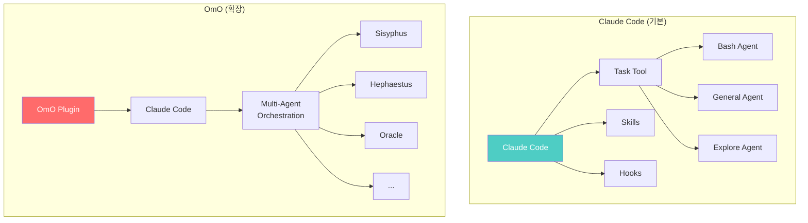

# 06. Claude Code에 OmO 개념 적용하기

## 🎯 Claude Code vs OmO 비교

### 기본 구조 비교



### 핵심 차이점

| 기능 | Claude Code | OmO | 설명 |
|------|------------|-----|------|
| **에이전트** | 5개 (고정) | 8개+ (확장) | 더 많은 전문가 |
| **오케스트레이션** | Task 도구 | Sisyphus | 고급 조율 시스템 |
| **병렬 실행** | 수동 | 자동 | 자동 병렬화 |
| **자동 완료** | ❌ | ✅ Ralph Loop | 끝까지 자동 진행 |
| **에러 복구** | 기본 | 3-Strike + Oracle | 고급 복구 |
| **모델 선택** | Claude만 | 다중 모델 | GPT, Kimi 등 |

## 🔧 Claude Code의 기본 기능들

### 1. Task Tool (에이전트 호출)

**Claude Code의 Task 도구:**

```typescript
// Claude Code에서 에이전트 호출
task({
  subagent_type: "Bash",
  prompt: "Git 상태 확인하고 변경사항 커밋해줘",
  description: "Git 작업 실행"
})
```

**OmO에서의 확장:**

```typescript
// OmO는 더 많은 에이전트 타입 제공
task({
  subagent_type: "Hephaestus",  // 자율 코딩 전문
  prompt: "쇼핑몰 백엔드 API 만들어줘",
  description: "자율 백엔드 개발",
  run_in_background: true  // 병렬 실행
})
```

### 2. Skills (기능 확장)

**Claude Code의 Skills:**

```bash
# .claude/skills/ 디렉토리
skills/
├── commit/         # Git 커밋 자동화
├── review-pr/      # PR 리뷰
└── test-runner/    # 테스트 실행
```

**OmO의 Skill-Embedded MCPs:**

```bash
# OmO는 더 많은 스킬 제공
.opencode/skills/
├── git-master/         # 고급 Git 관리
├── frontend-ui-ux/     # UI/UX 전문
├── playwright/         # 브라우저 자동화
├── github-triage/      # GitHub 관리
└── ultra-refactor/     # 고급 리팩토링
```

### 3. Hooks (이벤트 처리)

**Claude Code의 Hooks:**

```json
// .claude/settings.json
{
  "hooks": {
    "pre-bash": "echo '명령 실행 전'",
    "post-bash": "echo '명령 실행 후'"
  }
}
```

**OmO의 Hook 확장:**

```json
// .opencode/oh-my-opencode.json
{
  "hooks": {
    "pre-task": "IntentGate 체크",
    "post-task": "TODO 자동 업데이트",
    "on-error": "3-Strike Recovery 시작"
  }
}
```

## 🎨 OmO 개념을 Claude Code에 적용하기

### 예시 1: 멀티 에이전트 시스템 흉내내기

**Claude Code로 유사한 효과 만들기:**

```typescript
// 1. 여러 Task를 병렬로 실행 (OmO의 병렬 실행 흉내)
async function multiAgentTask() {
  // Sisyphus처럼 작업 분석
  const todos = [
    "백엔드 API 개발",
    "프론트엔드 UI 개발",
    "테스트 코드 작성",
    "문서 작성"
  ];

  // 병렬 실행 (OmO의 Hephaestus + Sisyphus-Jr 역할)
  await Promise.all([
    task({
      subagent_type: "general-purpose",
      prompt: "백엔드 API를 Node.js + Express로 만들어줘",
      run_in_background: true
    }),
    task({
      subagent_type: "general-purpose",
      prompt: "React로 프론트엔드 UI 만들어줘",
      run_in_background: true
    })
  ]);

  // 순차 실행 (의존성 있는 작업)
  await task({
    subagent_type: "test-runner",
    prompt: "모든 테스트 실행"
  });
}
```

### 예시 2: TODO 시스템 구현하기

**Claude Code의 TodoWrite를 활용:**

```typescript
// OmO의 TODO 시스템을 Claude Code로 구현
TodoWrite({
  todos: [
    {
      content: "프로젝트 구조 파악",
      status: "completed",
      activeForm: "구조 파악 중"
    },
    {
      content: "백엔드 API 개발",
      status: "in_progress",
      activeForm: "API 개발 중"
    },
    {
      content: "프론트엔드 개발",
      status: "pending",
      activeForm: "프론트엔드 개발 중"
    }
  ]
});

// Ralph Loop 흉내: TODO가 완료될 때까지 반복
async function ralphLoop() {
  let todos = getTodos();

  while (todos.some(t => t.status !== 'completed')) {
    const nextTodo = todos.find(t => t.status === 'pending');

    if (nextTodo) {
      await executeTask(nextTodo);
      updateTodoStatus(nextTodo.id, 'completed');
      todos = getTodos();
    }
  }

  console.log("모든 작업 완료!");
}
```

### 예시 3: Oracle 패턴 (3-Strike Recovery)

```typescript
// OmO의 Oracle 패턴을 Claude Code로 구현
async function taskWithRecovery(taskPrompt: string, maxRetries: number = 3) {
  let attempts = 0;
  let lastError = null;

  while (attempts < maxRetries) {
    try {
      // 작업 시도
      const result = await task({
        subagent_type: "general-purpose",
        prompt: taskPrompt
      });

      return result; // 성공!

    } catch (error) {
      attempts++;
      lastError = error;
      console.log(`시도 ${attempts}/${maxRetries} 실패`);
    }
  }

  // 3번 실패 → Oracle 역할 (전문가 에이전트 호출)
  console.log("Oracle 모드: 전문가 에이전트 호출");
  return await task({
    subagent_type: "Plan",  // 더 강력한 에이전트
    prompt: `다음 작업이 계속 실패합니다. 해결책을 제시해주세요:\n
            작업: ${taskPrompt}\n
            에러: ${lastError}`
  });
}
```

### 예시 4: Skill로 전문 에이전트 만들기

**프론트엔드 전문 Skill 만들기:**

```typescript
// .claude/skills/frontend-expert/skill.ts
export const frontendExpertSkill = {
  name: "frontend-expert",
  description: "프론트엔드 전문가 (OmO의 Sisyphus-Jr Frontend 역할)",

  async execute(context: SkillContext) {
    // 프론트엔드 전문 프롬프트 주입
    const enhancedPrompt = `
당신은 프론트엔드 전문가입니다.

전문 분야:
- React 컴포넌트 설계
- 상태 관리 (Redux, Zustand)
- CSS-in-JS (styled-components, Emotion)
- 성능 최적화

원칙:
- 컴포넌트 재사용성 최대화
- 접근성 (a11y) 준수
- 반응형 디자인
- 성능 우선

원래 요청: ${context.prompt}
    `;

    return await task({
      subagent_type: "general-purpose",
      prompt: enhancedPrompt,
      model: "sonnet" // 빠른 모델
    });
  }
};
```

**사용 방법:**

```bash
# Claude Code에서 실행
$ /frontend-expert "쇼핑몰 상품 목록 컴포넌트 만들어줘"
```

## 🔄 OmO 워크플로우를 Claude Code로 재현하기

### 완전한 오케스트레이션 예시

```typescript
// ultra-work.ts - OmO의 ultrawork 명령 재현
async function ultrawork(userRequest: string) {
  console.log("🎩 Sisyphus 모드: 작업 분석 시작");

  // 1단계: 작업 분석 (Sisyphus 역할)
  const analysis = await task({
    subagent_type: "Plan",
    prompt: `다음 요청을 분석하고 세부 작업으로 나눠주세요:
            "${userRequest}"

            출력 형식:
            - 작업 목록 (우선순위 순)
            - 병렬 실행 가능한 작업 구분
            - 예상 시간`
  });

  // 2단계: TODO 생성
  const todos = parseTodos(analysis);
  TodoWrite({ todos });

  // 3단계: 탐색 (Explorer/Librarian 역할)
  console.log("🔍 Explorer: 프로젝트 구조 파악");
  const structure = await task({
    subagent_type: "Explore",
    prompt: "프로젝트 구조와 기술 스택을 파악해주세요"
  });

  // 4단계: 병렬 실행 (Hephaestus + Sisyphus-Jr)
  console.log("🔥 작업 실행: 병렬 모드");
  const parallelTasks = todos.filter(t => t.parallel);
  const results = await Promise.all(
    parallelTasks.map(todo =>
      task({
        subagent_type: selectAgent(todo),
        prompt: todo.content,
        run_in_background: true
      })
    )
  );

  // 5단계: 순차 실행 (의존성 있는 작업)
  const sequentialTasks = todos.filter(t => !t.parallel);
  for (const todo of sequentialTasks) {
    console.log(`⏳ 진행 중: ${todo.content}`);

    // 3-Strike Recovery 적용
    await taskWithRecovery(todo.content);

    // TODO 업데이트
    updateTodo(todo.id, 'completed');
  }

  // 6단계: 검증
  console.log("✅ 검증 중...");
  await task({
    subagent_type: "test-runner",
    prompt: "모든 테스트를 실행하고 결과를 보고해주세요"
  });

  console.log("🎉 모든 작업 완료!");
}

// 사용 예시
ultrawork("쇼핑몰 웹사이트 완전히 만들어줘");
```

## 🎛️ 설정 파일 비교

### Claude Code 설정

```json
// .claude/settings.json
{
  "model": "claude-sonnet-4-5",
  "temperature": 0.7,
  "dangerMode": false,
  "autoApprove": {
    "read": true,
    "write": false,
    "bash": false
  },
  "hooks": {
    "pre-bash": "echo 'Starting command...'",
    "post-bash": "echo 'Command completed.'"
  }
}
```

### OmO 설정

```json
// .opencode/oh-my-opencode.json
{
  "orchestrator": {
    "agent": "Sisyphus",
    "models": ["claude-opus-4-6", "kimi-k2.5", "glm-5"],
    "autoComplete": true,
    "ralphLoop": true
  },
  "agents": {
    "Sisyphus": {
      "model": "claude-opus-4-6",
      "role": "orchestrator"
    },
    "Hephaestus": {
      "model": "gpt-5.3-codex",
      "role": "autonomous-worker"
    },
    "Oracle": {
      "model": "claude-opus-4-6",
      "role": "consultant",
      "triggerOn": "3-strikes"
    },
    "Sisyphus-Jr": {
      "categories": {
        "frontend": {
          "model": "claude-sonnet-4-5",
          "context": "프론트엔드 전문가"
        },
        "backend": {
          "model": "gpt-5.3-codex",
          "context": "백엔드 전문가"
        }
      }
    }
  },
  "features": {
    "parallelExecution": true,
    "sessionResume": true,
    "intentGate": true,
    "todoEnforcer": true,
    "boulderMechanism": true
  },
  "hooks": {
    "pre-task": "intentGate",
    "on-error": "3-strike-recovery",
    "post-task": "todo-update"
  }
}
```

## 🛠️ Claude Code Hook으로 OmO 기능 구현

### Hook 1: Intent Gate

```bash
# .claude/hooks/intent-gate.sh
#!/bin/bash

# 사용자 입력 분석
USER_INPUT="$1"

# 의도가 불명확한 키워드 체크
if echo "$USER_INPUT" | grep -qE "개선|최적화|수정|고쳐"; then
    echo "⚠️  의도가 불명확합니다. 구체적으로 설명해주세요:"
    echo "   - 어떤 부분을 개선하나요?"
    echo "   - 목표는 무엇인가요?"
    exit 1
fi

echo "✅ 의도 명확. 진행합니다."
```

### Hook 2: TODO Enforcer

```bash
# .claude/hooks/todo-enforcer.sh
#!/bin/bash

# TODO 파일 확인
TODO_FILE=".claude/todos.json"

if [ -f "$TODO_FILE" ]; then
    # 미완료 TODO 체크
    INCOMPLETE=$(jq '[.[] | select(.status != "completed")] | length' "$TODO_FILE")

    if [ "$INCOMPLETE" -gt 0 ]; then
        echo "⚠️  미완료 TODO가 ${INCOMPLETE}개 있습니다!"
        echo "   계속 진행할까요?"

        # Boulder Mechanism: 자동으로 다음 TODO 실행
        NEXT_TODO=$(jq -r '[.[] | select(.status == "pending")][0].content' "$TODO_FILE")
        if [ "$NEXT_TODO" != "null" ]; then
            echo "▶️  다음 작업: $NEXT_TODO"
        fi
    fi
fi
```

### Hook 3: 3-Strike Recovery

```bash
# .claude/hooks/error-recovery.sh
#!/bin/bash

ERROR_COUNT_FILE=".claude/error_count.txt"
TASK_ID="$1"

# 에러 카운트 증가
if [ -f "$ERROR_COUNT_FILE" ]; then
    COUNT=$(cat "$ERROR_COUNT_FILE")
else
    COUNT=0
fi

COUNT=$((COUNT + 1))
echo $COUNT > "$ERROR_COUNT_FILE"

echo "❌ 에러 발생 (${COUNT}/3)"

if [ "$COUNT" -eq 3 ]; then
    echo "🔮 Oracle 모드: 전문가 에이전트 호출"
    # Plan 에이전트 호출 (Oracle 역할)
    claude code task --agent Plan --prompt "이 작업이 계속 실패합니다. 해결책을 제시해주세요."

    # 카운트 리셋
    echo 0 > "$ERROR_COUNT_FILE"
fi
```

## 📚 OmO 스타일 Skill 만들기

### Frontend Expert Skill

```typescript
// .claude/skills/frontend-expert/index.ts
export default {
  name: "frontend-expert",
  description: "프론트엔드 전문가 (Sisyphus-Jr Frontend 카테고리 모방)",

  systemPrompt: `
당신은 프론트엔드 전문가입니다. OmO의 Sisyphus-Jr Frontend 카테고리 역할을 수행합니다.

전문 분야:
- React 18+ (Hooks, Suspense, Concurrent Features)
- TypeScript
- 상태 관리 (Redux Toolkit, Zustand, Jotai)
- 스타일링 (Tailwind, styled-components, CSS Modules)
- 빌드 도구 (Vite, Webpack)
- 테스팅 (Vitest, Testing Library)

작업 원칙:
1. 컴포넌트 재사용성 최대화
2. 타입 안정성 보장
3. 접근성 (WCAG 2.1 AA) 준수
4. 성능 최적화 (React.memo, useMemo, useCallback)
5. 코드 분할 (lazy, Suspense)

출력 형식:
- 코드 + 설명
- 주요 결정 사항 명시
- 잠재적 이슈 경고
  `,

  async execute({ args, task }: SkillContext) {
    const userPrompt = args || "프론트엔드 작업을 도와주세요";

    return await task({
      subagent_type: "general-purpose",
      prompt: this.systemPrompt + "\n\n사용자 요청:\n" + userPrompt,
      model: "sonnet" // 빠른 처리
    });
  }
};
```

### Backend Expert Skill

```typescript
// .claude/skills/backend-expert/index.ts
export default {
  name: "backend-expert",
  description: "백엔드 전문가 (Sisyphus-Jr Backend 카테고리 모방)",

  systemPrompt: `
당신은 백엔드 전문가입니다. OmO의 Sisyphus-Jr Backend 카테고리 역할을 수행합니다.

전문 분야:
- Node.js / Express / NestJS
- 데이터베이스 (PostgreSQL, MongoDB, Redis)
- API 설계 (RESTful, GraphQL)
- 인증/인가 (JWT, OAuth, Passport)
- ORM (Prisma, TypeORM)
- 메시징 (RabbitMQ, Kafka)

작업 원칙:
1. 보안 우선 (SQL Injection, XSS 방지)
2. 에러 처리 철저
3. 입력 검증 필수
4. 트랜잭션 관리
5. 로깅 및 모니터링

출력 형식:
- 코드 + 아키텍처 설명
- 보안 고려사항
- 성능 최적화 팁
  `,

  async execute({ args, task }: SkillContext) {
    return await task({
      subagent_type: "general-purpose",
      prompt: this.systemPrompt + "\n\n" + args,
      model: "sonnet"
    });
  }
};
```

## 🎮 실전 사용 시나리오

### 시나리오: OmO 스타일로 웹사이트 만들기

```typescript
// ultrawork.ts - Claude Code에서 OmO 흉내내기
import { task, TodoWrite } from '@claude/sdk';

async function ultrawork_website() {
  console.log("🎩 Sisyphus 모드 활성화");

  // 1. TODO 생성
  TodoWrite({
    todos: [
      {
        content: "프로젝트 초기 설정",
        status: "pending",
        activeForm: "프로젝트 초기 설정 중"
      },
      {
        content: "백엔드 API 개발",
        status: "pending",
        activeForm: "백엔드 API 개발 중"
      },
      {
        content: "프론트엔드 UI 개발",
        status: "pending",
        activeForm: "프론트엔드 UI 개발 중"
      },
      {
        content: "테스트 및 배포",
        status: "pending",
        activeForm: "테스트 및 배포 중"
      }
    ]
  });

  // 2. 프로젝트 설정 (순차)
  console.log("📦 Step 1: 프로젝트 초기 설정");
  await task({
    subagent_type: "general-purpose",
    prompt: `
Node.js + React 프로젝트를 세팅해주세요:
- 백엔드: Express + TypeScript + Prisma
- 프론트엔드: React + Vite + Tailwind
- 모노레포: pnpm workspace
    `
  });

  // TODO 업데이트
  TodoWrite({
    todos: [
      { content: "프로젝트 초기 설정", status: "completed" },
      { content: "백엔드 API 개발", status: "in_progress" },
      // ...
    ]
  });

  // 3. 병렬 개발 (Hephaestus + Sisyphus-Jr 역할)
  console.log("🔥 Step 2: 병렬 개발 시작");
  await Promise.all([
    // Backend
    task({
      subagent_type: "general-purpose",
      prompt: "백엔드 API 만들기: /backend-expert '사용자 인증 API'",
      run_in_background: true
    }),

    // Frontend
    task({
      subagent_type: "general-purpose",
      prompt: "프론트엔드 UI 만들기: /frontend-expert '로그인 페이지'",
      run_in_background: true
    })
  ]);

  // 4. 테스트 (Atlas 역할)
  console.log("✅ Step 3: 테스트 및 배포");
  await task({
    subagent_type: "test-runner",
    prompt: "전체 테스트 실행"
  });

  // 5. 배포
  await task({
    subagent_type: "Bash",
    prompt: "Docker로 컨테이너화하고 배포 준비"
  });

  console.log("🎉 완료!");
}
```

**실행:**

```bash
$ claude code run ultrawork.ts
```

## 📊 기능 매핑표

| OmO 기능 | Claude Code 구현 방법 |
|----------|----------------------|
| **Sisyphus** | Task(subagent_type: "Plan") + 커스텀 로직 |
| **Oracle** | 3-Strike Hook + Task(subagent_type: "Plan") |
| **Librarian** | Task(subagent_type: "Explore") + Grep/Read |
| **Hephaestus** | Task(subagent_type: "general-purpose", background: true) |
| **Atlas** | Task(subagent_type: "Bash") + Docker 스킬 |
| **Prometheus** | Task(subagent_type: "Plan") + AskUserQuestion |
| **Sisyphus-Jr** | 커스텀 Skills (frontend-expert, backend-expert 등) |
| **Ralph Loop** | while 루프 + TodoWrite |
| **Boulder Mechanism** | Hook (todo-enforcer.sh) |
| **7-Section Delegation** | systemPrompt에 구조화된 프롬프트 |
| **Session Resume** | Task ID 기반 컨텍스트 재사용 |
| **Intent Gate** | pre-task Hook |

## 🎓 핵심 정리

### Claude Code로 OmO 효과 내는 법

```
1. Task 도구 적극 활용
   → 병렬 실행 (run_in_background)
   → 적절한 에이전트 선택

2. Skills로 전문화
   → frontend-expert
   → backend-expert
   → 도메인별 스킬 생성

3. Hooks로 자동화
   → intent-gate (의도 분석)
   → todo-enforcer (강제 완료)
   → error-recovery (3-Strike)

4. TodoWrite로 진행 추적
   → TODO 리스트 관리
   → 상태 업데이트
   → Ralph Loop 구현

5. 구조화된 프롬프트
   → 7-Section Delegation 패턴
   → 명확한 역할 부여
   → 제약사항 명시
```

### OmO를 설치하면 더 좋은 점

```
직접 구현:
- 각 기능을 Skill/Hook으로 직접 만들어야 함
- 오케스트레이션 로직 직접 작성
- 유지보수 부담

OmO 설치:
✅ 모든 기능 기본 제공
✅ 검증된 오케스트레이션
✅ 자동 업데이트
✅ 커뮤니티 지원
```

## 🎯 다음 단계

이제 실전 예시를 봅시다:

1. ✅ **01-프로젝트-소개.md** - 프로젝트 소개
2. ✅ **02-기본-개념.md** - 용어 설명
3. ✅ **03-전체-구조.md** - 시스템 구조
4. ✅ **04-에이전트-역할.md** - 에이전트 상세
5. ✅ **05-동작-원리.md** - 작동 과정
6. ✅ **06-claude-code-적용.md** ← 지금 여기
7. ➡️ **07-실전-예시.md** - 실제 사용 사례들

---

**💡 핵심 요약**
- **Claude Code는 기본**, **OmO는 확장판**
- Task + Skills + Hooks로 유사한 효과 가능
- 직접 구현 vs OmO 설치는 선택의 문제
- OmO 개념을 이해하면 Claude Code를 더 잘 활용 가능
- 멀티 에이전트 패턴은 어디서든 유용
