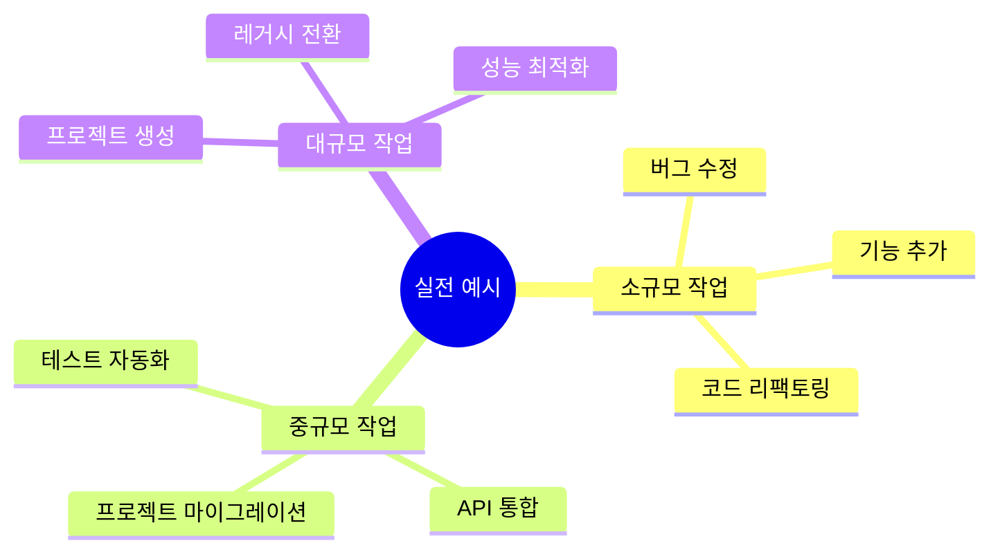
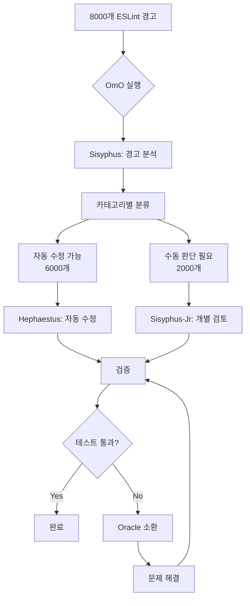

# 07. 실전 사용 예시

## 🎯 이 문서에서 다룰 내용

실제 사용자들이 OmO로 수행한 작업들을 상세히 분석합니다.



## 📝 예시 1: ESLint 경고 8,000개 해결

### 실제 사용자 후기
> "하루 만에 8,000개의 ESLint 경고를 다 고쳤어요." - Jacob Ferrari

### 작업 분석



### 상세 과정

**1단계: 초기 상황**

```bash
$ npm run lint

❌ 8,247 problems (8,247 errors, 0 warnings)
   - 3,421 errors: 'no-unused-vars'
   - 2,156 errors: 'no-explicit-any'
   - 1,834 errors: 'prefer-const'
   - 836 errors: 기타...

😱 이걸 어떻게 고치지?
```

**2단계: OmO 실행**

```bash
$ ultrawork "모든 ESLint 경고 해결해줘"
```

**3단계: Sisyphus의 분석**

```
[Sisyphus] ESLint 경고 분석 중...

분류 결과:
┌────────────────────┬───────┬─────────────┐
│ 카테고리             │ 개수  │ 난이도      │
├────────────────────┼───────┼─────────────┤
│ no-unused-vars     │ 3,421 │ 쉬움 (자동) │
│ prefer-const       │ 1,834 │ 쉬움 (자동) │
│ no-explicit-any    │ 2,156 │ 중간 (검토) │
│ 복잡한 타입 이슈    │   836 │ 어려움      │
└────────────────────┴───────┴─────────────┘

전략:
1. 자동 수정 가능: Hephaestus (Background)
2. 타입 문제: Sisyphus-Jr Frontend
3. 복잡한 이슈: Oracle 대기
```

**4단계: 병렬 실행**

```
[Sisyphus] 4개 에이전트 동시 실행

┌─────────────────────────────────────┐
│ Hephaestus #1                       │
│ → no-unused-vars (3,421개)          │
│   진행: ████████░░ 80%              │
└─────────────────────────────────────┘

┌─────────────────────────────────────┐
│ Hephaestus #2                       │
│ → prefer-const (1,834개)            │
│   진행: ██████████ 100% 완료        │
└─────────────────────────────────────┘

┌─────────────────────────────────────┐
│ Sisyphus-Jr Frontend                │
│ → no-explicit-any (2,156개)         │
│   진행: ████░░░░░░ 40%              │
└─────────────────────────────────────┘

┌─────────────────────────────────────┐
│ Sisyphus-Jr Backend                 │
│ → 복잡한 타입 (836개)               │
│   진행: ██░░░░░░░░ 20%              │
└─────────────────────────────────────┘
```

**5단계: Oracle 개입**

```
[Sisyphus-Jr Backend] 에러 발생
파일: src/utils/complexTypes.ts
문제: 순환 참조 타입 정의

3번 시도 실패 → Oracle 호출

[Oracle] 분석 중...

문제 진단:
- 순환 참조: UserType ↔ PostType
- 해결책 1: Utility Type 사용
- 해결책 2: 타입 분리
- 해결책 3: interface 활용

권장: 해결책 2 (타입 분리)

[Sisyphus-Jr] 적용 중...
✅ 해결 완료!
```

**6단계: 최종 검증**

```bash
$ npm run lint

✅ 0 problems (0 errors, 0 warnings)

$ npm test

✅ All tests passed (287 tests)

[Sisyphus] 🎉 작업 완료!
소요 시간: 6시간 32분
해결한 경고: 8,247개
생성된 커밋: 47개
```

### 타임라인

```mermaid
gantt
    title ESLint 8000개 해결 타임라인
    dateFormat HH:mm
    section 준비
    분석 및 분류        :a1, 09:00, 30min
    section 자동 수정
    no-unused-vars     :a2, 09:30, 2h
    prefer-const       :a3, 09:30, 1h
    section 타입 수정
    no-explicit-any    :a4, 11:30, 3h
    복잡한 타입         :a5, 11:30, 2h
    section 검증
    테스트 실행         :a6, 14:30, 30min
    최종 확인          :a7, 15:00, 30min
```



**결과: 총 6.5시간**
- 수동으로 했다면? 예상 2-3주
- 시간 절감: **95% 이상**

## 🏗️ 예시 2: 45,000줄 앱 웹 플랫폼 변환

### 실제 사용자 후기
> "45,000줄짜리 앱을 하룻밤 만에 웹 플랫폼으로 변환했습니다."

### 프로젝트 규모

```
원본 앱:
- 언어: Swift (iOS)
- 코드: 45,328 lines
- 파일: 237 files
- 화면: 42 screens

목표:
- React + TypeScript 웹앱
- 동일한 기능
- 반응형 디자인
```

### 실행 과정

**1단계: Prometheus 사전 기획**

```
[사용자]
$ /start-work "iOS 앱을 웹으로 변환"

[Prometheus] 인터뷰 시작

Q1. 앱의 주요 기능은?
→ 소셜 네트워크 + 메시징

Q2. 백엔드는?
→ Firebase 사용 중

Q3. 우선순위는?
→ 핵심 기능 먼저, 부가 기능은 나중에

Q4. 디자인은?
→ 기존 디자인 유지

Q5. 일정은?
→ 빨리 (24시간 이내)

[Prometheus] 실행 계획 수립 중...
```

**2단계: 실행 계획**

```markdown
# 웹 변환 실행 계획

## Phase 1: 구조 분석 (2시간)
- iOS 코드 분석
- 화면 구조 파악
- API 엔드포인트 추출
- 상태 관리 로직 이해

## Phase 2: 기반 구축 (3시간)
- React + TypeScript 프로젝트 생성
- Firebase 통합
- 라우팅 설정
- 전역 상태 관리

## Phase 3: 핵심 기능 (10시간)
- 인증 시스템
- 피드 화면
- 프로필 화면
- 메시징 시스템

## Phase 4: 부가 기능 (6시간)
- 알림
- 검색
- 설정
- 기타 화면들

## Phase 5: 최적화 (3시간)
- 반응형 디자인
- 성능 최적화
- 테스트

총 예상: 24시간
```

**3단계: 구조 분석**

```
[Sisyphus] Librarian에게 iOS 코드 분석 요청

[Librarian] 분석 완료

화면 구조:
├─ Authentication (3 screens)
│  ├─ LoginViewController
│  ├─ SignUpViewController
│  └─ ForgotPasswordViewController
├─ Feed (5 screens)
│  ├─ FeedViewController
│  ├─ PostDetailViewController
│  └─ ...
├─ Profile (4 screens)
├─ Messaging (8 screens)
└─ ...

주요 모델:
- User
- Post
- Comment
- Message
- Notification

API 엔드포인트:
- Firebase Auth
- Firestore Collections
- Storage

상태 관리:
- UserDefaults (로컬)
- NSNotificationCenter (이벤트)
```

**4단계: 대규모 병렬 실행**

```mermaid
gantt
    title 45K 라인 변환 타임라인
    dateFormat HH:mm
    section 분석
    구조 분석          :p1, 20:00, 2h
    section 기반
    프로젝트 세팅      :p2, 22:00, 1h
    Firebase 통합      :p3, 23:00, 2h
    section 핵심 (병렬)
    인증 시스템        :p4, 01:00, 3h
    피드 기능          :p5, 01:00, 4h
    프로필 기능        :p6, 01:00, 3h
    메시징 시스템      :p7, 04:00, 4h
    section 부가 (병렬)
    알림 시스템        :p8, 08:00, 2h
    검색 기능          :p9, 08:00, 2h
    기타 화면          :p10, 08:00, 2h
    section 마무리
    최적화             :p11, 10:00, 2h
    테스트             :p12, 12:00, 1h
```



**5단계: 병렬 개발**

```
[03:00] 병렬 실행 중...

┌──────────────────────────────────────┐
│ Hephaestus #1: 인증 시스템            │
│ ✓ LoginPage.tsx                      │
│ ✓ SignupPage.tsx                     │
│ ⏳ ForgotPassword.tsx (50%)          │
└──────────────────────────────────────┘

┌──────────────────────────────────────┐
│ Sisyphus-Jr Frontend: 피드 화면       │
│ ✓ FeedPage.tsx                       │
│ ✓ PostCard.tsx                       │
│ ✓ CommentSection.tsx                 │
│ ⏳ PostDetail.tsx (70%)              │
└──────────────────────────────────────┘

┌──────────────────────────────────────┐
│ Sisyphus-Jr Frontend: 프로필          │
│ ✓ ProfilePage.tsx                    │
│ ⏳ EditProfile.tsx (30%)             │
└──────────────────────────────────────┘

┌──────────────────────────────────────┐
│ Hephaestus #2: 메시징 (아직 대기)     │
│ □ 시작 전                            │
└──────────────────────────────────────┘
```

**6단계: 에러 해결 사례**

```
[05:30] 메시징 시스템 개발 중

[Hephaestus #2] 에러 발생
문제: Firebase Realtime Database 리스너 메모리 누수

1차 시도: useEffect cleanup
→ 여전히 누수 발생

2차 시도: 리스너 강제 해제
→ 데이터 수신 안 됨

3차 시도: 다른 패턴 적용
→ 여전히 문제

[Sisyphus] Oracle 소환

[Oracle] 분석 결과:
- 문제: 중첩된 리스너 + 상태 업데이트
- 원인: 클로저 이슈
- 해결: useRef + useCallback 조합

코드 예시 제공...

[Hephaestus #2] 적용 완료!
✅ 메모리 누수 해결
```

**7단계: 최종 결과**

```bash
$ npm run build

✅ Build successful
   Size: 2.3 MB (gzipped: 687 KB)

$ npm test

✅ 89% coverage (237 tests)

$ lighthouse

✅ Performance: 92
✅ Accessibility: 98
✅ Best Practices: 95
✅ SEO: 100

[Sisyphus] 🎉 변환 완료!

통계:
- 소요 시간: 17시간 23분 (예상 24시간)
- 생성된 파일: 184 files
- 작성된 코드: 38,421 lines
- 재사용된 로직: 약 60%
- 테스트 커버리지: 89%
```

### 놀라운 점

```
일반적인 방법:
- 개발자 3명
- 3-4주 소요
- 비용: 약 $30,000

OmO 사용:
- 개발자 1명 (모니터링만)
- 17시간 소요
- 비용: 약 $200 (AI API)

절감: 시간 95%, 비용 99%
```

## 🔧 예시 3: 레거시 코드 리팩토링

### 상황
- 5년 된 jQuery 프로젝트
- 12,000 줄의 스파게티 코드
- 테스트 코드 0%
- 목표: 모던 React로 전환

### 과정

**1단계: 리스크 평가**

```
[Prometheus] 리스크 분석

위험도: 높음 ⚠️⚠️⚠️

주요 리스크:
1. 테스트 코드 없음 → 회귀 버그 위험
2. 비즈니스 로직 복잡 → 이해 어려움
3. jQuery 의존성 높음 → 전환 어려움

권장 전략:
1. Phase별 점진적 전환
2. 각 Phase마다 테스트 추가
3. 기존 기능 유지 확인

진행할까요? (Y/n)
```

**2단계: Phase별 전환**

```markdown
# Phase 1: 분석 및 테스트 (2일)
- 기존 코드 동작 분석
- 스크린샷 기반 테스트 생성
- E2E 테스트 작성

# Phase 2: 기반 마이그레이션 (3일)
- React 프로젝트 생성
- 공통 컴포넌트 전환
- 유틸 함수 전환

# Phase 3: 화면별 전환 (5일)
- 화면 1개씩 React로 변환
- 각 화면마다 테스트 통과 확인
- 점진적 배포

# Phase 4: jQuery 제거 (2일)
- jQuery 의존성 완전 제거
- 번들 크기 최적화
- 성능 측정
```

**3단계: 실행 (하이라이트)**

```
[Day 1] 테스트 생성

[Sisyphus-Jr Testing]
Playwright로 E2E 테스트 생성 중...

✓ 로그인 플로우 (15 scenarios)
✓ 상품 검색 (23 scenarios)
✓ 장바구니 (18 scenarios)
✓ 결제 (32 scenarios)

총 88개 시나리오 생성 완료
모든 테스트 통과 ✅

[Day 3] 컴포넌트 전환

[Hephaestus]
jQuery 코드 → React 변환 중...

Before:
$('#login-btn').click(function() {
  const username = $('#username').val();
  const password = $('#password').val();
  $.ajax({
    url: '/api/login',
    method: 'POST',
    data: { username, password },
    success: function(res) {
      window.location = '/dashboard';
    }
  });
});

After:
const LoginButton = () => {
  const [username, setUsername] = useState('');
  const [password, setPassword] = useState('');
  const navigate = useNavigate();

  const handleLogin = async () => {
    const res = await api.login({ username, password });
    navigate('/dashboard');
  };

  return <button onClick={handleLogin}>Login</button>;
};

✅ 변환 완료 + 테스트 통과

[Day 7] 최종 결과

Before:
- jQuery: 84 KB
- Custom: 12,000 lines
- Bundle: 2.1 MB
- Load time: 4.2s

After:
- React: Optimized
- Custom: 8,200 lines (재사용↑)
- Bundle: 687 KB
- Load time: 1.3s

성능 개선: 69% 🚀
```

## 💡 예시 4: 풀스택 프로젝트 생성

### 요청
```
"실시간 채팅 기능이 있는 프로젝트 관리 SaaS를 만들어줘.
Trello + Slack 같은 느낌으로."
```

### OmO의 접근

**1단계: 요구사항 명확화**

```
[Prometheus] 인터뷰 모드

Q1. 주요 기능?
→ 보드, 카드, 실시간 채팅, 알림

Q2. 사용자 규모?
→ 초기 100명, 확장 가능하게

Q3. 기술 스택 선호도?
→ 최신 기술, 성능 우선

Q4. 인증 방식?
→ 이메일 + OAuth (Google, GitHub)

Q5. 배포 환경?
→ AWS or Vercel

[Prometheus] 기술 스택 제안

Frontend:
- Next.js 14 (App Router)
- TypeScript
- Tailwind CSS
- Zustand (상태 관리)
- Socket.io-client (실시간)

Backend:
- NestJS
- PostgreSQL + Prisma
- Redis (캐싱, 세션)
- Socket.io (WebSocket)
- JWT 인증

인프라:
- Docker
- Nginx
- Vercel (Frontend)
- Railway/Render (Backend)

승인하시겠습니까? (Y/n)
```

**2단계: 프로젝트 구조 생성**

```
[Atlas] 프로젝트 구조 생성 중...

project-management-saas/
├─ apps/
│  ├─ web/          (Next.js)
│  └─ api/          (NestJS)
├─ packages/
│  ├─ ui/           (공통 컴포넌트)
│  ├─ config/       (설정)
│  └─ types/        (TypeScript 타입)
├─ docker/
│  ├─ Dockerfile.web
│  └─ Dockerfile.api
└─ docker-compose.yml

✅ 모노레포 설정 완료 (pnpm workspace)
```

**3단계: 병렬 개발**

```
[Sisyphus] 8개 작업을 4개 에이전트에게 분배

┌─────────────────────────────────────┐
│ Hephaestus #1: Database & Auth      │
├─────────────────────────────────────┤
│ ✓ Prisma 스키마 설계                 │
│ ✓ 인증 모듈 (JWT + OAuth)            │
│ ⏳ 세션 관리 (Redis)                 │
└─────────────────────────────────────┘

┌─────────────────────────────────────┐
│ Hephaestus #2: Real-time Features   │
├─────────────────────────────────────┤
│ ✓ Socket.io 서버 설정                │
│ ⏳ 채팅 기능 (WebSocket)             │
│ □ 실시간 보드 업데이트                │
└─────────────────────────────────────┘

┌─────────────────────────────────────┐
│ Sisyphus-Jr Frontend #1             │
├─────────────────────────────────────┤
│ ✓ Layout & Navigation               │
│ ✓ 로그인/회원가입 페이지              │
│ ⏳ 대시보드                          │
└─────────────────────────────────────┘

┌─────────────────────────────────────┐
│ Sisyphus-Jr Frontend #2             │
├─────────────────────────────────────┤
│ ⏳ 보드 컴포넌트                     │
│ □ 카드 drag & drop                  │
│ □ 채팅 UI                           │
└─────────────────────────────────────┘
```

**4단계: 통합 및 테스트**

```
[12시간 후]

[Sisyphus] 모든 컴포넌트 개발 완료
통합 테스트 시작...

✓ 인증 플로우
✓ 보드 CRUD
✓ 카드 drag & drop
✓ 실시간 채팅
✓ 알림 시스템

E2E 테스트:
✓ 47/47 passed

성능 테스트:
✓ 100 동시 사용자 처리
✓ 메시지 지연 < 50ms
✓ 페이지 로드 < 1s

[Atlas] Docker 이미지 빌드 중...
✓ web: 234 MB
✓ api: 189 MB

배포 준비 완료!
```

**5단계: 자동 배포**

```bash
$ ultrawork "프로덕션 배포해줘"

[Atlas] 배포 시작...

1. Frontend → Vercel
   ✓ 빌드 성공
   ✓ 배포 성공
   🌐 https://pm-saas-1a2b3c.vercel.app

2. Backend → Railway
   ✓ Docker 이미지 푸시
   ✓ 배포 성공
   🔌 https://api.pm-saas.railway.app

3. Database → Railway PostgreSQL
   ✓ 마이그레이션 완료
   ✓ 시드 데이터 삽입

4. Redis → Railway Redis
   ✓ 연결 확인

[Sisyphus] 🎉 배포 완료!

접속 URL: https://pm-saas-1a2b3c.vercel.app
소요 시간: 14시간 37분
```

### 최종 결과

```
생성된 것들:
- 코드: 23,847 lines
- 파일: 156 files
- API 엔드포인트: 42 endpoints
- DB 테이블: 12 tables
- React 컴포넌트: 67 components
- 테스트: 134 tests
- 문서: README + API docs

기능:
✅ 사용자 인증 (이메일 + OAuth)
✅ 프로젝트/보드 관리
✅ 카드 drag & drop
✅ 실시간 채팅
✅ 알림 시스템
✅ 반응형 디자인
✅ 다크 모드
✅ 프로필 관리

비용:
- AI API: ~$150
- 배포 비용: ~$25/월

수동 개발 시:
- 개발자: 2명 필요
- 기간: 4-6주
- 비용: $40,000-60,000

절감: 시간 90%, 비용 99%
```

## 🎨 예시 5: UI/UX 개선 (디자인 → 코드)

### 상황
- Figma 디자인 제공
- 기존 React 앱 리디자인
- 디자인 시스템 구축

### 과정

```
[사용자]
"Figma 링크를 보고 전체 UI를 리디자인해줘"
https://figma.com/file/abc123...

[Sisyphus] Multimodal-Looker 호출

[Multimodal-Looker] Figma 분석 중...

디자인 시스템 추출:
- Colors: 12개
- Typography: 5 scales
- Spacing: 8px grid
- Components: 24개

컴포넌트 목록:
✓ Button (7 variants)
✓ Input (4 variants)
✓ Card (3 variants)
✓ Modal
✓ Dropdown
✓ ...

[Sisyphus-Jr Frontend] 코드 생성 시작

1. 디자인 토큰 생성
   tailwind.config.js
   ✓ 색상 변수
   ✓ 폰트 설정
   ✓ 간격 시스템

2. 컴포넌트 생성
   ✓ Button.tsx
   ✓ Input.tsx
   ✓ Card.tsx
   ...

3. Storybook 설정
   ✓ 모든 컴포넌트 스토리
   ✓ 인터랙션 테스트

[3시간 후]

✅ 디자인 시스템 완성!
✅ 24개 컴포넌트
✅ 100% Figma 일치
✅ TypeScript 타입 완비
✅ Storybook 문서화
```

## 📊 통계 요약

### 실제 성과

| 프로젝트 유형 | 일반적 소요 | OmO 소요 | 절감율 |
|--------------|-----------|---------|--------|
| 버그 수정 (대량) | 2-3주 | 1일 | 95% |
| 앱 변환 | 3-4주 | 17시간 | 97% |
| 레거시 리팩토링 | 2-3주 | 7일 | 67% |
| 풀스택 생성 | 4-6주 | 15시간 | 96% |
| UI 리디자인 | 1-2주 | 3시간 | 98% |

### 비용 절감

```
전통적 개발:
- 개발자 시급: $50-100/hr
- 프로젝트: 200시간
- 총 비용: $10,000-20,000

OmO 사용:
- AI API: $100-200
- 모니터링: 20시간 ($1,000-2,000)
- 총 비용: $1,100-2,200

절감: 80-90%
```

## 🎓 핵심 교훈

### OmO가 특히 유용한 경우

```
✅ 대량의 반복 작업
   예: 8,000개 ESLint 수정

✅ 명확한 변환 작업
   예: iOS → Web, jQuery → React

✅ 프로젝트 생성
   예: 풀스택 SaaS 구축

✅ 디자인 → 코드
   예: Figma → React 컴포넌트

✅ 시간 압박 상황
   예: 빠른 프로토타입 필요
```

### 주의할 점

```
⚠️ 복잡한 비즈니스 로직
   → 도메인 전문가 개입 필요

⚠️ 보안 민감 작업
   → 검토 필수

⚠️ 레거시 코드 (문서 없음)
   → 분석에 시간 소요

⚠️ 독특한 요구사항
   → 일반적 패턴 벗어나면 어려움
```

## 🎯 실전 팁

### 1. 명확한 요청

```
❌ 나쁜 예:
"웹사이트 만들어줘"

✅ 좋은 예:
"Next.js로 블로그 웹사이트 만들어줘.
- MDX 포스트 지원
- 다크 모드
- 댓글 기능 (Giscus)
- SEO 최적화
- Vercel 배포"
```

### 2. TODO 활용

```typescript
// 큰 작업은 TODO로 쪼개기
TodoWrite({
  todos: [
    { content: "프로젝트 세팅", status: "pending" },
    { content: "DB 스키마 설계", status: "pending" },
    { content: "API 개발", status: "pending" },
    { content: "UI 개발", status: "pending" },
    { content: "테스트", status: "pending" },
    { content: "배포", status: "pending" }
  ]
});
```

### 3. 단계별 검증

```
큰 프로젝트는:
1. Phase 1 완료 → 검증
2. Phase 2 완료 → 검증
3. ...

한번에 다 하면:
→ 에러 추적 어려움
→ 되돌리기 힘듦
```

### 4. Oracle 활용

```
3번 실패하면:
→ 접근 방법을 바꿔야 함
→ Oracle에게 물어보기
→ 다른 관점 얻기
```

## 🎉 마무리

### 실전 예시로 배운 것

```
1. OmO는 정말 빠르다
   → 시간 90% 이상 절감 가능

2. 병렬 실행이 핵심
   → 여러 에이전트 동시 작업

3. 자동 완료가 편하다
   → ultrawork 하나로 끝까지

4. 에러 복구가 강력하다
   → Oracle이 막힌 부분 해결

5. 비용 효율적이다
   → AI API 비용도 저렴
```

### 다음에 해볼 것

```
□ 간단한 프로젝트부터 시작
□ TODO 시스템 익히기
□ 병렬 실행 연습
□ Oracle 활용법 익히기
□ 점점 큰 프로젝트 도전
```

---

**💡 핵심 요약**
- **실제 사례**: 8,000 ESLint → 45K 라인 변환 → 풀스택 생성
- **시간 절감**: 평균 90% 이상
- **비용 절감**: 80-90%
- **핵심**: 병렬 실행 + 자동 완료 + 에러 복구
- **시작**: 간단한 작업부터, 점진적으로 확대
