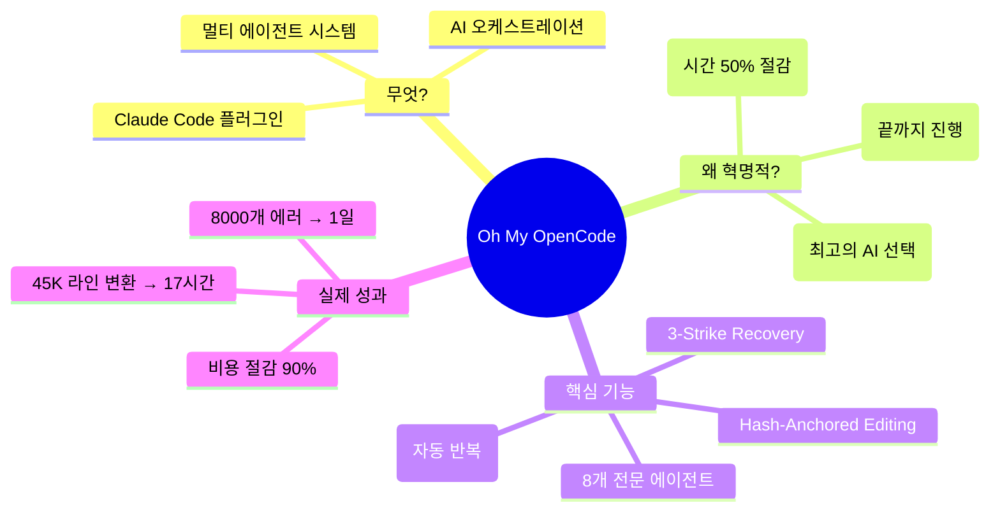
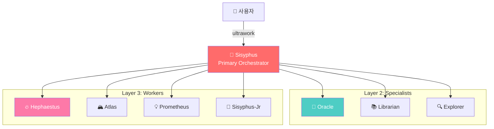
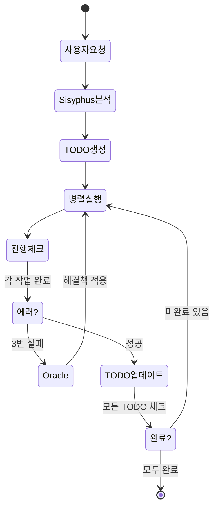

# Oh My OpenCode - 중학생도 이해하는 완벽 가이드

## 📚 이 문서에 대해

이 가이드는 **Oh My OpenCode (OmO)** 프로젝트를 중학생도 이해할 수 있도록 쉽게 설명한 종합 분석 문서입니다.

OmO는 AI 코딩 도우미를 "혼자 일하는 친구"에서 "전문가 팀"으로 업그레이드해주는 혁신적인 도구입니다.

## 🎯 핵심 요약



### 한 문장 요약

> **OmO = AI를 "1명"에서 "8명의 전문가 팀"으로 업그레이드하여, 자동으로 끝까지 완성해주는 시스템**

## 📖 문서 구조

### 🌟 초급 단계 (반드시 읽기)

#### [01. 프로젝트 소개](01-프로젝트-소개.md)
- 🎯 **읽어야 하는 이유**: OmO가 뭔지, 왜 중요한지 이해
- **내용**: 프로젝트 개요, 인기도, 핵심 명령어
- **소요 시간**: 5분
- **난이도**: ⭐☆☆☆☆

```
이것부터 읽으세요!
- OmO가 뭔지
- 왜 38,000 stars를 받았는지
- 기존 AI 도구와 뭐가 다른지
```

#### [02. 기본 개념](02-기본-개념.md)
- 🎯 **읽어야 하는 이유**: 에이전트, 오케스트레이션 등 핵심 용어 이해
- **내용**: 10가지 핵심 개념을 쉬운 비유로 설명
- **소요 시간**: 10분
- **난이도**: ⭐⭐☆☆☆

```
이해해야 할 용어들:
✓ 에이전트 = 자율 AI
✓ 오케스트레이션 = 팀 조율
✓ 병렬 실행 = 동시 작업
✓ LSP/AST = 정확한 코드 수정
✓ Vendor Lock-in = 한 회사 종속 (나쁨)
```

### 🔥 중급 단계 (깊이 이해하기)

#### [03. 전체 구조](03-전체-구조.md)
- 🎯 **읽어야 하는 이유**: 시스템이 어떻게 설계되었는지 파악
- **내용**: 3계층 아키텍처, 에이전트 구성, 모델 선택 전략
- **소요 시간**: 15분
- **난이도**: ⭐⭐⭐☆☆

```
핵심 구조:
Layer 1: Sisyphus (지휘자)
   ↓
Layer 2: Specialists (컨설턴트)
   ↓
Layer 3: Workers (실행자)
```

#### [04. 에이전트 역할](04-에이전트-역할.md)
- 🎯 **읽어야 하는 이유**: 각 에이전트가 정확히 뭘 하는지 이해
- **내용**: 8개 에이전트 상세 설명 + Mermaid 다이어그램
- **소요 시간**: 20분
- **난이도**: ⭐⭐⭐☆☆

```
등장인물 소개:
🎩 Sisyphus - 팀장
🔮 Oracle - 문제해결 전문가
📚 Librarian - 정보 검색 전문가
🔥 Hephaestus - 자율 코딩 전문가
🏔️ Atlas - 운영/배포 전문가
💡 Prometheus - 전략 기획자
... 등
```

### 🚀 고급 단계 (실전 적용)

#### [05. 동작 원리](05-동작-원리.md)
- 🎯 **읽어야 하는 이유**: 실제로 어떻게 작동하는지 시퀀스 다이어그램으로 이해
- **내용**: 4가지 시나리오별 상세 흐름도, Ralph Loop, Boulder Mechanism
- **소요 시간**: 25분
- **난이도**: ⭐⭐⭐⭐☆

```
배울 내용:
→ 간단한 작업 (30초 완성)
→ 중간 작업 (병렬 실행)
→ 복잡한 작업 (에러 복구)
→ 자동 완료 시스템
```

#### [06. Claude Code 적용](06-claude-code-적용.md)
- 🎯 **읽어야 하는 이유**: OmO 개념을 Claude Code에 어떻게 적용하는지
- **내용**: Claude Code vs OmO 비교, Skill/Hook 구현 예시
- **소요 시간**: 20분
- **난이도**: ⭐⭐⭐⭐☆

```
실용적인 내용:
✓ OmO 없이도 유사한 효과 내기
✓ Skills로 전문 에이전트 만들기
✓ Hooks로 자동화 구현
✓ ultrawork 명령 재현하기
```

#### [07. 실전 예시](07-실전-예시.md)
- 🎯 **읽어야 하는 이유**: 실제 성공 사례로 감 잡기
- **내용**: 5가지 실전 프로젝트 상세 분석
- **소요 시간**: 30분
- **난이도**: ⭐⭐⭐⭐⭐

```
실제 사례:
1️⃣ ESLint 8,000개 → 1일 해결
2️⃣ 45,000줄 iOS 앱 → 17시간에 웹 변환
3️⃣ 레거시 jQuery → React 전환
4️⃣ 풀스택 SaaS 14시간 생성
5️⃣ Figma → React 컴포넌트 3시간
```

## 🎓 학습 경로

### 빠르게 핵심만 (30분)

```
1. 01-프로젝트-소개 (5분)
2. 02-기본-개념 (10분)
3. 07-실전-예시 (15분)
```

### 완전히 이해하기 (2시간)

```
1. 01-프로젝트-소개 (5분)
2. 02-기본-개념 (10분)
3. 03-전체-구조 (15분)
4. 04-에이전트-역할 (20분)
5. 05-동작-원리 (25분)
6. 06-claude-code-적용 (20분)
7. 07-실전-예시 (30분)
```

### Claude Code 사용자 (1시간)

```
1. 01-프로젝트-소개 (5분)
2. 02-기본-개념 (10분) - 용어만
3. 06-claude-code-적용 (20분) ⭐ 여기 집중
4. 07-실전-예시 (25분) - 적용 방법
```

### 개발자 (상세 학습)

```
모든 문서 순서대로 읽기
+ 각 예시 코드 직접 실행해보기
+ 자신의 프로젝트에 적용해보기
```

## 📊 프로젝트 정보

### 기본 정보

| 항목 | 내용 |
|------|------|
| **이름** | Oh My OpenCode (OmO) |
| **저장소** | https://github.com/code-yeongyu/oh-my-opencode |
| **Stars** | 38,700+ ⭐ |
| **언어** | TypeScript |
| **라이선스** | SUL-1.0 |
| **유형** | Claude Code 플러그인 |

### 핵심 통계

```
에이전트 수: 8개+
지원 모델: Claude, GPT, Kimi, GLM
병렬 실행: ✅
자동 완료: ✅ (Ralph Loop)
에러 복구: ✅ (3-Strike + Oracle)
비용 절감: 30-50%
시간 절감: 50-90%
```

### 실제 성과

| 지표 | 일반 도구 | OmO | 개선율 |
|------|----------|-----|--------|
| 개발 속도 | 기준 | 2-10배 빠름 | +100-900% |
| 비용 | 기준 | 30-50% | -50-70% |
| 에러율 | 기준 | 낮음 | Hash 검증 |
| 코드 품질 | 기준 | 동등 이상 | LSP 사용 |

## 🎨 시각적 요약

### 전체 아키텍처



### 작업 흐름



## 💡 핵심 개념 한눈에

### 멀티 에이전트 시스템

```
기존 AI:
  1명이 모든 걸 함
  → 느리고 지침

OmO:
  8명이 역할 분담
  → 빠르고 정확
```

### 병렬 실행

```
순차 실행:
  작업1 [30분] → 작업2 [20분] → 작업3 [40분]
  총 90분

병렬 실행:
  작업1 [30분] ┐
  작업2 [20분] ├→ 동시 진행
  작업3 [40분] ┘
  총 40분 (가장 긴 작업 기준)
```

### Ralph Loop (자동 완료)

```
일반 AI:
  "작업 하나 완료했어요!"
  사용자: "다음 작업 해줘"
  "또 완료했어요!"
  사용자: "또 다음..." (반복)

OmO Ralph Loop:
  "작업 시작합니다!"
  [자동으로 모든 작업 진행]
  [TODO가 있으면 절대 멈추지 않음]
  "모든 작업 완료!"
```

### 3-Strike Recovery

```
1차 실패: 다시 시도
2차 실패: 다른 방법
3차 실패: Oracle 소환 (전문가 호출)
Oracle 실패: 사용자에게 질문
```

## 🛠️ 설치 및 사용

### 기본 설치

```bash
# NPM으로 설치
npm install -g oh-my-opencode

# 또는 Claude Code 플러그인으로 사용
```

### 기본 명령어

```bash
# 마법의 명령어 - 이것만 기억하세요!
ultrawork    # 또는 줄여서: ulw

# 예시
ultrawork "쇼핑몰 웹사이트 만들어줘"
ulw "React를 TypeScript로 변환해줘"
```

### 고급 명령어

```bash
# 전략 기획 모드
/start-work "복잡한 프로젝트"

# 프로젝트 컨텍스트 생성
/init-deep

# 특정 에이전트 호출
/hephaestus "자율 코딩 작업"
/oracle "문제 해결 조언"
```

## 🌟 이 문서의 특징

### ✅ 장점

- **쉬운 설명**: 중학생도 이해 가능
- **풍부한 비유**: 축구팀, 오케스트라, 주방 등
- **시각화**: Mermaid 다이어그램 다량 사용
- **실전 중심**: 실제 사례 5가지 상세 분석
- **단계별 학습**: 초급 → 중급 → 고급
- **Claude Code 연결**: 바로 적용 가능

### 📚 포함된 내용

- ✅ 개념 설명 (10개 핵심 용어)
- ✅ 아키텍처 분석 (3계층 구조)
- ✅ 에이전트 역할 (8개 상세)
- ✅ 동작 원리 (4가지 시나리오)
- ✅ Claude Code 적용법
- ✅ 실전 예시 (5개 프로젝트)
- ✅ 40개 이상의 Mermaid 다이어그램

## 🎯 대상 독자

### 👨‍🎓 초보자
- AI 코딩 도구 처음 사용
- 기술 용어 낯설음
- 쉬운 설명 필요

**추천**: 01 → 02 → 07

### 👨‍💻 Claude Code 사용자
- Claude Code 기본 사용 중
- OmO 기능 이해하고 싶음
- 바로 적용하고 싶음

**추천**: 01 → 02 → 06 → 07

### 👨‍🔬 개발자
- 멀티 에이전트 시스템 이해
- 아키텍처 깊이 파고들기
- 직접 구현 고려

**추천**: 전체 순서대로

### 🏢 의사결정자
- 도구 도입 검토
- ROI 계산 필요
- 실제 성과 확인

**추천**: 01 → 07

## 📈 기대 효과

### 이 가이드를 읽으면

```
✅ OmO가 뭔지 완벽히 이해
✅ 멀티 에이전트 시스템 개념 파악
✅ Claude Code에 바로 적용 가능
✅ 개발 생산성 2-10배 향상
✅ AI 도구 활용 능력 상승
```

### 실제로 얻을 수 있는 것

```
💰 비용 절감: 30-90%
⏱️ 시간 절약: 50-95%
🎯 정확도 향상: Hash 검증
🚀 생산성 증가: 병렬 실행
🧠 지식 습득: 멀티 에이전트 패턴
```

## 🔗 관련 링크

### 공식 자료

- **GitHub**: https://github.com/code-yeongyu/oh-my-opencode
- **Discord**: https://discord.gg/PUwSMR9XNk
- **X (Twitter)**: [@justsisyphus](https://x.com/justsisyphus)
- **Sisyphus Labs**: https://sisyphuslabs.ai

### 이전 분석 (참고)

- **기존 분석 폴더**: `/Users/rio/Documents/idea-bank/260213-oh-my-opencode-agent-analysis/`
- **차이점**: 이 가이드는 훨씬 더 쉽고 상세함

## 📝 업데이트 로그

### 2026-03-10
- 초기 가이드 작성 완료
- 7개 상세 문서 작성
- 40개 이상 Mermaid 다이어그램 추가
- 실전 예시 5개 상세 분석
- Claude Code 적용법 추가
- 중학생 수준의 쉬운 설명

## 🙏 감사의 말

이 가이드는 Oh My OpenCode 프로젝트를 분석하여 작성되었습니다.

- **프로젝트 창립자**: YeonGyu Kim
- **커뮤니티**: 38,000+ GitHub Stars
- **영감**: 실제 사용자들의 성공 사례

## 💬 피드백

이 가이드에 대한 피드백은 언제나 환영입니다!

- 이해하기 어려운 부분
- 추가했으면 하는 내용
- 오타나 오류

## 🎉 마무리

### 이제 시작하세요!

```
1. 01-프로젝트-소개.md 읽기
2. 흥미로운 부분 깊이 파기
3. Claude Code에 적용해보기
4. 실전 프로젝트 도전하기
```

### 핵심 한 줄

> **OmO는 AI를 "혼자"에서 "팀"으로 바꿔서, 알아서 끝까지 완성해주는 마법 같은 도구입니다!**

---

**행운을 빕니다! 🚀**

이 가이드로 여러분의 개발 생산성이 폭발적으로 향상되기를 바랍니다.

**Remember**:
- `ultrawork` 명령 하나로 모든 것이 시작됩니다
- TODO가 남아있으면 절대 멈추지 않습니다
- 8명의 전문가 팀이 여러분을 돕습니다

**Happy Coding! 💻✨**
